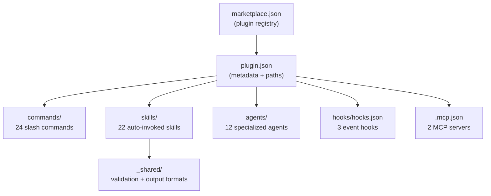
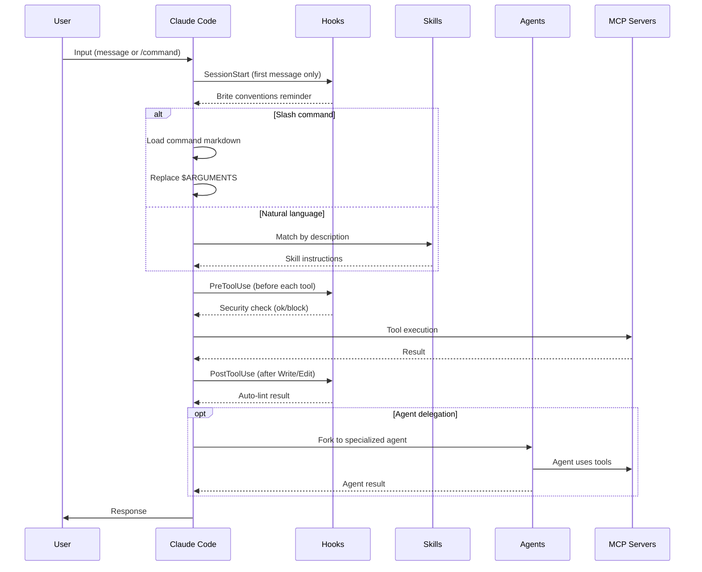
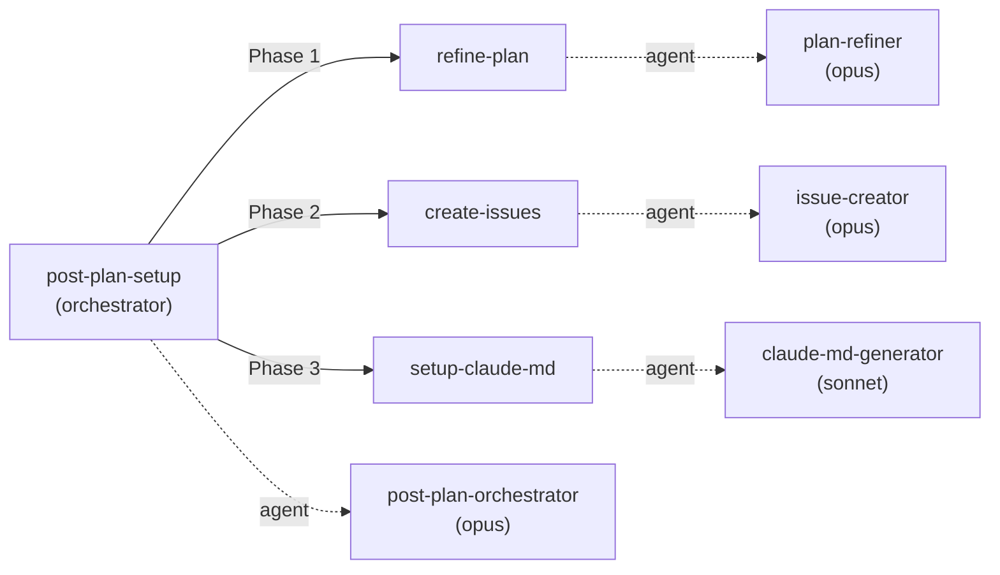
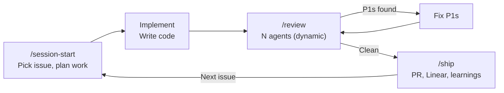
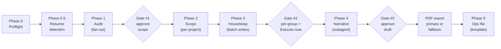
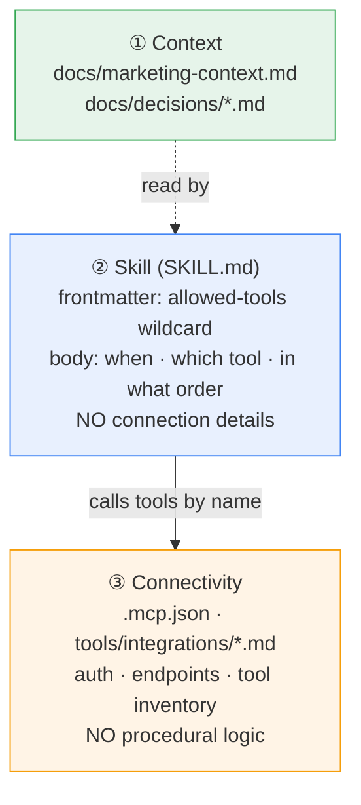

# Architecture

How the Brite Claude Plugins bundle is structured, how it executes, and why it's built this way.

## System Overview



The plugin is a **single-plugin bundle**: one marketplace, one plugin. This keeps distribution simple while allowing future plugins to be added to the same bundle.

## Plugin Resolution

When a user installs the bundle, Claude Code:

1. Reads `.claude-plugin/marketplace.json` to discover available plugins
2. Follows the `source` path (e.g., `./plugins/workflows`) to find the plugin directory
3. Reads `plugins/workflows/.claude-plugin/plugin.json` for metadata and component paths
4. Loads commands from `./commands/`, skills from `./skills/`, agents from `./agents/`
5. Registers hooks from `./hooks/hooks.json` (auto-discovered, not declared in plugin.json)
6. Configures MCP servers from `./.mcp.json`

All paths in `plugin.json` are relative to the plugin root (`plugins/workflows/`).

## Runtime Flow



## Skill Routing

Skills activate based on their `description` field — Claude reads descriptions and selects the best match for the user's intent.

### Inner Loop (auto-activate in sequence)

| Skill | Triggers on | Purpose |
|-------|-------------|---------|
| `brainstorming` | Non-trivial issue, before planning | Socratic discovery, design document |
| `precedent-search` | During brainstorming or planning | Search past decision traces from project and org INDEX |
| `writing-plans` | Multi-step task, before coding | Bite-sized tasks with TDD, verification |
| `git-worktrees` | After plan approval, before coding | Isolated workspace with Linear issue ID |
| `executing-plans` | Given an approved plan | Subagent-per-task + TDD + checkpoints |
| `verification-before-completion` | Task checkpoints | 4-level verification before marking done |
| `compound-learnings` | After completing work (via ship) | Knowledge capture to CLAUDE.md + memory |
| `best-practices-audit` | After compound (via ship) | CLAUDE.md audit + auto-fix |
| `handbook-drift-check` | After best-practices audit (via ship) | Detect handbook drift, open handbook PR |
| `systematic-debugging` | Bug investigation (anytime) | 4-phase root-cause analysis |

### Backend & Quality

| Skill | Triggers on | Purpose |
|-------|-------------|---------|
| `python-best-practices` | Writing, reviewing, refactoring FastAPI/Python code | Architectural patterns audit |
| `react-best-practices` | Writing, reviewing React or Next.js code | Performance optimization patterns |
| `testing-strategy` | Writing, reviewing, or refactoring test code | Testing patterns (Vitest, RTL, MSW, Playwright, pytest) |
| `code-quality` | Setting up or reviewing ESLint, Prettier, Ruff, mypy | Linting/formatting config |

### Design Skills (Three-Way Split)

| Skill | Triggers | Purpose | Example Prompt |
|-------|----------|---------|----------------|
| `frontend-design` | "build", "create", "implement" UI | Write production code | "Build a dashboard with Tailwind" |
| `ui-ux-pro-max` | "choose palette", "design system", "plan visual direction" | Design planning & exploration | "Help me pick colors for a SaaS app" |
| `web-design-guidelines` | "review", "audit", "check" existing UI | Compliance review | "Review my landing page for accessibility" |

### Post-Plan

| Skill | Triggers on | Purpose |
|-------|-------------|---------|
| `post-plan-setup` | After `/plan-project` produces a v1 plan | Orchestrates refine → create-issues → setup-claude-md |
| `refine-plan` | Called by post-plan-setup (not user-invocable) | Refine v1 plans into agent-ready tasks |
| `create-issues` | Called by post-plan-setup (not user-invocable) | Create Linear issues from refined plans |
| `setup-claude-md` | Called by post-plan-setup (not user-invocable) | Generate best-practices CLAUDE.md |

### Utility

| Skill | Triggers on | Purpose |
|-------|-------------|---------|
| `agent-browser` | Navigate websites, fill forms, take screenshots | Browser automation for web testing |
| `find-skills` | "how do I do X", "find a skill for X" | Discover and install agent skills |

## Post-Plan Workflow

The post-plan workflow is the most complex subsystem — an orchestrated pipeline of 3 skills + 4 agents.



**Flow:**
1. User invokes `/workflows:post-plan-setup <plan-path>`
2. **Phase 1 — Refine Plan**: `refine-plan` decomposes the v1 plan into agent-ready tasks with context, steps, and validation criteria. Outputs `docs/project-plan-refined.md`.
3. *Pause for user review*
4. **Phase 2 — Create Issues**: `create-issues` creates Linear issues from the refined plan via MCP. Updates the plan file with issue IDs.
5. *Pause for user review*
6. **Phase 3 — Setup CLAUDE.md**: `setup-claude-md` analyzes the codebase and generates a best-practices CLAUDE.md.
7. *Pause for user review*

**Agent model selection:**
- `plan-refiner`, `issue-creator`, `post-plan-orchestrator` use **opus** — complex reasoning and multi-step coordination
- `claude-md-generator` uses **sonnet** — structured generation from clear templates, doesn't need opus-level reasoning

**Known limitation:** Sub-skills declare `context: fork` for isolated agent execution, but this feature has upstream bugs ([#16803](https://github.com/anthropics/claude-code/issues/16803), [#17283](https://github.com/anthropics/claude-code/issues/17283)). Currently, skills run inline in the parent context.

## Session Workflow

The v2.0.0 session commands create a complete development loop:



**`/session-start`**: Pulls latest, queries Linear for open issues, helps pick one, creates an execution plan.

**`/review`**: Haiku-powered diff triage gates trivial diffs, then dynamically selects Opus-powered review agents based on depth mode and stack (3-10 agents). Tier 1 always runs (code, security, performance); Tier 2 activates for detected stacks (TypeScript, Python, data); Tier 3 is conditional/opt-in (architecture, accessibility, test-quality, CDR compliance). Per-finding validation (Opus for P1s, Sonnet for P2/P3s) confirms findings before auto-fixing P1s. Reports P2/P3s.

**`/ship`**: Creates PR, updates Linear issue status, compounds learnings to CLAUDE.md and memory, suggests next issue.

### Review Agents

| Tier | Agent | Model | Focus |
|------|-------|-------|-------|
| — (gating) | `diff-triage` | haiku | Pre-filters trivial diffs before expensive review pipeline |
| 1 (always) | `code-reviewer` | opus | Bugs, logic errors, edge cases |
| 1 (always) | `security-reviewer` | opus | OWASP Top 10, secrets exposure, auth issues |
| 1 (always) | `performance-reviewer` | opus | Algorithmic complexity, N+1, memory leaks, bundle size |
| 2 (stack) | `typescript-reviewer` | opus | Type safety, React/Next.js patterns, hook rules |
| 2 (stack) | `python-reviewer` | opus | FastAPI, Pydantic v2, async patterns, type hints |
| 2 (stack) | `data-reviewer` | opus | Migration safety, schema constraints, query patterns |
| 3 (conditional) | `architecture-reviewer` | opus | Coupling, SOLID, dependency direction, boundaries |
| 3 (conditional) | `accessibility-reviewer` | opus | WCAG 2.1, keyboard nav, ARIA, screen reader |
| 3 (conditional) | `test-quality-reviewer` | opus | Coverage gaps, flakiness, test structure, edge cases |

All agents produce findings in the same `**[P1/P2/P3]** file:line — title` format with confidence scores (1-10). Agent selection is dynamic — see `/workflows:review` Step 4. Per-finding validation (Step 6) uses Opus for P1s and Sonnet for P2/P3s.

## Cadence Plugin: Weekly Planning Workflow

`/cadence:weekly` orchestrates a five-phase loop that replaces the manual Brite weekly-planning flow. Phases flow via a session-scoped state object; a `.cadence-phase-state.json` breadcrumb in the week folder supports kill-and-resume across phases.



**Agents used by Cadence:**

| Agent | Model | Phase | Purpose |
|---|---|---|---|
| `project-audit` | haiku | 1 | Per-project audit card: shipped / carry-over / dropped / by-assignee rollup / quality-gate flags. Read-only Linear MCP. |
| `narrative-writer` | opus | 4 | Voice-bound draft of `w<NN>-sprint-narrative.md`. `Read`-only tools; Linear data provided via state JSON in the dispatch body. |

**Skills used by Cadence:**

| Skill | Phase | Purpose |
|---|---|---|
| `sprint-scoping` | 2 | Sequential per-project interview (5 carry-over + 5 scope Qs, one at a time), issue-quality gate with block-with-override, appends checkpoint per project. |
| `linear-housekeeping` | 3 | Derives mutations from Phase 2 scope; re-runs quality gate on cycle-path rows; renders preview grouped by decision path; collects per-group approval + final execute gate; writes audit log. |
| `_shared/issue-quality-gate` | 1, 2, 3 | 7-check gate primitive: assignee / title / priority / state-cycle alignment / dependencies / AC / done-with-evidence. |

**MCP servers.** None registered by Cadence — Linear is inherited from the `workflows` plugin via `mcp__plugin_workflows_linear-server__*`. `gh` CLI covers the GitHub probe in Phase 0.4.

**Artifacts per week.** The week folder at `weekly-planning/w<NN>-<YYYY-MM-DD>/` accumulates: `.cadence-phase-state.json` (breadcrumb), `audit.json` (Phase 1), `w<NN>-planning-checkpoint.md` (Phase 2), `w<NN>-housekeeping-log.md` (Phase 3), `w<NN>-sprint-narrative.md` + `.pdf` (Phase 4), `w<NN>-remaining-ops.md` (Phase 5).

## Hook Execution

Hooks use a **two-layer security architecture**: deterministic regex command hooks run first (fast, no LLM), then haiku prompt hooks as fallback for anything the regex misses.

| Event | Matcher | Layer | Type | What It Checks |
|-------|---------|-------|------|----------------|
| `PreToolUse` | `Bash` | 1 (regex) | command | Blocks `rm -rf`, `--force`, `DROP`, `chmod 777`, piped downloads |
| `PreToolUse` | `Bash` | 2 (fallback) | prompt | Haiku evaluates anything not caught by regex |
| `PreToolUse` | `Write\|Edit` | 1 (regex) | command | Blocks `sk-proj-`, `AKIA`, `ghp_`, `sk_live/test` patterns |
| `PreToolUse` | `Write\|Edit` | 2 (fallback) | prompt | Haiku evaluates anything not caught by regex |
| `PostToolUse` | `Write\|Edit` | — | command | Auto-lint: ESLint (JS/TS) or Ruff (Python) if installed |
| `SessionStart` | `startup` | — | prompt | Reminds Claude of Brite conventions |

**Why two layers?** Regex command hooks are deterministic and instant — they catch known-bad patterns without LLM latency or cost. The haiku prompt hook catches novel threats the regex misses.

**Why command (not prompt) for the linter?** Linting is deterministic — no LLM judgment needed. A shell command is faster and more reliable.

## Agent Delegation

Skills can reference agents via the `agent:` frontmatter field. The agent definition (in `agents/*.md`) specifies:

- `model`: Which Claude model to use
- `tools`: Allowed tool list (scoped for safety)
- System prompt with role and principles

Agents are more constrained than the parent session — they receive only the tools listed in their definition, preventing scope creep.

## MCP Server Integration

| Server | Transport | Package / URL | Purpose |
|--------|-----------|---------------|---------|
| `sequential-thinking` | stdio | `@modelcontextprotocol/server-sequential-thinking` | Structured multi-step reasoning for complex analysis |
| `linear-server` | HTTP | `https://mcp.linear.app/mcp` | Linear project management — issues, projects, teams |

`sequential-thinking` is used by the post-plan skills for plan decomposition and analysis. `linear-server` is used by `create-issues` to create and manage Linear issues.

## Skill ↔ MCP Integration Pattern

When a skill needs to call an external service, three layers compose with a strict one-way flow — context informs skills, skills call tools, but each layer only describes its own concern.



**The rule.** If deleting the MCP server would break the text, it belongs in the integration guide. If changing the workflow would break the text, it belongs in the skill. Connection details (URLs, bearer tokens, OAuth flows) never appear in skill bodies; procedural "do X then Y" sequences never appear in integration guides.

**Canonical example in this repo.** `plugins/workflows/skills/create-issues/SKILL.md` declares `allowed-tools: mcp__plugin_workflows_sequential-thinking__sequentialthinking, mcp__plugin_workflows_linear-server__*` and calls Linear tools by semantic name (`list_teams`, `list_projects`, `create_project`) — never mentioning the Linear URL or auth flow.

**Frontmatter form.** `mcp__plugin_<plugin>_<server>__*` for multi-tool servers; `mcp__plugin_<plugin>_<server>__<tool_name>` for single-tool servers. See the guide for the full rule set.

**Full spec** — pattern definition, frontmatter conventions, integration guide structure, canonical example walkthrough, tool-depth decision table, PR checklist, and anti-patterns — in [`docs/guides/skill-tool-integration-pattern.md`](docs/guides/skill-tool-integration-pattern.md). Every skill that adds an external tool must pass the 6-item checklist at the end of that guide.

## Shared Utilities

Two files in `skills/_shared/` are referenced by multiple skills:

| File | Purpose | Used By |
|------|---------|---------|
| `validation-pattern.md` | Self-validation and retry loop (check → evaluate → retry up to 3x → flag for human) | refine-plan, create-issues, setup-claude-md |
| `output-formats.md` | Standard severity levels, finding format, summary blocks, progress format | code-review command, review-type skills |

These prevent duplication — skills reference them rather than embedding their own validation/formatting logic.

## Design Decisions

| Decision | Rationale |
|----------|-----------|
| Single plugin in marketplace | Simplicity — one bundle, one plugin. Add more plugins later if needed. |
| Description-based skill routing | Claude's native matching; no custom router needed. Descriptions must be distinct enough to avoid conflicts. |
| Haiku for security hooks | Fast (< 10s), cheap, sufficient for pattern matching. Doesn't block developer flow. |
| Opus for orchestrator agents | Complex multi-step coordination and reasoning. Worth the cost for plan quality. |
| Sonnet for CLAUDE.md generation | Structured output from clear templates. Opus would be overkill. |
| No build process | Plugin is pure markdown/JSON. No compilation, no dependencies, no lock files. |
| `context: fork` declared but not functional | Documents intended architecture. Will work when upstream bugs are fixed. |
| Shared utilities in `_shared/` | Prevents validation/formatting logic from being duplicated across skills. |
| Commands use `$ARGUMENTS` | Claude Code's native variable substitution. No custom parsing needed. |
| Hooks use separate file (`hooks.json`) | Cleaner than inline in plugin.json. Easier to review and modify. |

## File Map

Quick reference for finding things:

```
.claude-plugin/marketplace.json       # Bundle registry
plugins/workflows/
  .claude-plugin/plugin.json          # Plugin metadata (v2.0.0)
  commands/
    session-start.md                  # Pick a Linear issue, plan work
    review.md                         # Run review agents, fix P1s
    ship.md                           # Create PR, update Linear, learnings
    project-start.md                  # Guided project setup interview
    tech-stack.md                     # Display tech stack for decisions
    code-review.md                    # Standardized code review
    onboarding-checklist.md           # New dev environment setup
  skills/
    agent-browser/SKILL.md            # Browser automation
    find-skills/SKILL.md              # Skill discovery
    frontend-design/SKILL.md          # UI implementation (production code)
    react-best-practices/SKILL.md     # 45 Vercel React/Next.js rules
    ui-ux-pro-max/SKILL.md            # Design planning & exploration
    web-design-guidelines/SKILL.md    # UI compliance review
    post-plan-setup/SKILL.md          # Workflow orchestrator
    refine-plan/SKILL.md              # Plan → agent-ready tasks
    create-issues/SKILL.md            # Tasks → Linear issues
    setup-claude-md/SKILL.md          # Generate CLAUDE.md
    _shared/
      validation-pattern.md           # Self-validation & retry loop
      output-formats.md               # Standard output formatting
  agents/
    diff-triage.md                    # Diff triage gating agent (haiku)
    code-reviewer.md                  # Code quality reviewer (opus, Tier 1)
    security-reviewer.md              # Security vulnerability reviewer (opus, Tier 1)
    performance-reviewer.md           # Performance reviewer (opus, Tier 1)
    typescript-reviewer.md            # TypeScript/React reviewer (opus, Tier 2)
    python-reviewer.md                # Python/FastAPI reviewer (opus, Tier 2)
    data-reviewer.md                  # Database/migration reviewer (opus, Tier 2)
    architecture-reviewer.md          # Architecture reviewer (opus, Tier 3)
    accessibility-reviewer.md         # Accessibility reviewer (opus, Tier 3)
    test-quality-reviewer.md          # Test quality reviewer (opus, Tier 3)
    post-plan-orchestrator.md         # Orchestrator agent (opus)
    plan-refiner.md                   # Plan refinement agent (opus)
    issue-creator.md                  # Issue creation agent (opus)
    claude-md-generator.md            # CLAUDE.md generation agent (sonnet)
  hooks/hooks.json                    # Two-layer security + lint + session hooks
  .mcp.json                           # MCP server configs
```
