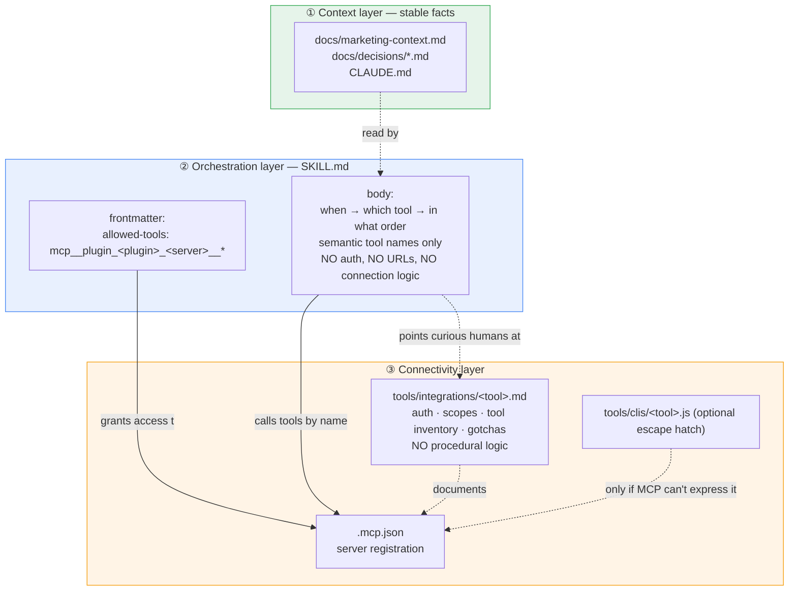

# Skill ↔ Tool Integration Pattern

How skills and external tools compose in this plugin bundle. The goal of this guide is a reusable blueprint every new tool-using skill can follow — grounded in Anthropic's own guidance and already working in four skills in `plugins/workflows/`.

**Read this before:** porting a marketing skill that calls an external service, writing a net-new outbound skill that orchestrates MCP servers, adding a new MCP server to any plugin, or authoring a `tools/integrations/<tool>.md` reference.

## The shape



**The single rule that makes this hang together:** instructions flow *down* — context informs skills, skills call tools — but each layer only describes its own concern.

- **Context layer** — facts the skill needs to make good decisions (brand, ICP, architecture, prior decisions). Lives in `docs/`, read by skills, knows nothing about tools.
- **Orchestration layer (the skill)** — *when* to use which tool, *in what order*, *for what outcome*. Invokes tools by their semantic name (`list_teams`, `create_campaign`, `add_email_to_blocklist`). **Owns zero connection details.**
- **Connectivity layer (the tool integration)** — *how* to reach the tool: auth flow, endpoints, rate limits, known quirks, full tool inventory. Lives in `.mcp.json` (machine-readable registration) and `tools/integrations/<tool>.md` (human-readable reference). **Owns zero procedural logic.**

This maps directly to Anthropic's own framing: MCP servers provide connectivity; skills provide expertise on top of it. See [Extending Claude's capabilities with skills and MCP](https://claude.com/blog/extending-claude-capabilities-with-skills-mcp-servers) and [Skills explained](https://claude.com/blog/skills-explained).

## Frontmatter convention

Every skill that calls MCP tools declares them in `allowed-tools`. Two forms, picked by the server's tool count:

```yaml
# Multi-tool server — use wildcard
allowed-tools: mcp__plugin_<plugin>_<server>__*, Read, Write, Glob, Grep

# Single-tool server — name the specific tool
allowed-tools: mcp__plugin_<plugin>_<server>__<tool_name>, Read, Write

# Mix both when the skill uses both kinds
allowed-tools: mcp__plugin_workflows_sequential-thinking__sequentialthinking, mcp__plugin_workflows_linear-server__*, Read, Write, Glob, Grep
```

The `plugin_<plugin>_` segment is Claude Code's automatic namespacing — it's derived from the plugin name at load time. Don't hand-edit it, don't guess at it; copy the form exactly and substitute server + tool.

**Precedent in this repo** (all in `plugins/workflows/skills/`):

| Skill | Frontmatter (line 5) | Pattern |
|---|---|---|
| `create-issues` | `mcp__plugin_workflows_sequential-thinking__sequentialthinking, mcp__plugin_workflows_linear-server__*, Read, Write, Glob, Grep` | Single-tool + wildcard |
| `post-plan-setup` | `mcp__plugin_workflows_sequential-thinking__sequentialthinking, mcp__plugin_workflows_linear-server__*, Read, Write, Bash(find:*), Bash(cat:*), Bash(ls:*), Glob, Grep` | Single-tool + wildcard |
| `refine-plan` | `mcp__plugin_workflows_sequential-thinking__sequentialthinking, Read, Write, Glob, Grep` | Single-tool only |
| `setup-claude-md` | `mcp__plugin_workflows_sequential-thinking__sequentialthinking, Read, Write, Bash(find:*), Bash(cat:*), Bash(ls:*), Glob, Grep` | Single-tool only |

## What goes where

| Concern | Belongs in skill | Belongs in integration guide |
|---|---|---|
| When to call the tool | ✅ | — |
| Why to call this tool vs another | ✅ | — |
| Sequence of tool calls for a workflow | ✅ | — |
| Expected output shape / success criteria | ✅ | — |
| Which context files to read first | ✅ | — |
| Semantic tool name (e.g. `list_teams`) | ✅ (by name) | ✅ (full inventory) |
| Full auth flow / credentials | — | ✅ |
| Endpoint URL / base URL | — | ✅ |
| Rate limits and quotas | — | ✅ |
| Scope / permission requirements | — | ✅ |
| Known gotchas, ESP quirks, bugs | — | ✅ |
| `.mcp.json` snippet for registration | — | ✅ |

A good test: if deleting the MCP server would break the text, it belongs in the integration guide. If changing the workflow would break the text, it belongs in the skill.

## Integration guide structure

The *What goes where* table above captures the principle; this section captures the document shape that enforces it. An integration guide must contain these nine sections, in this order. The template at [`plugins/marketing/tools/integrations/_template.md`](../../plugins/marketing/tools/integrations/_template.md) is the fillable form — every integration guide in this repo must conform to it.

| Section | Captures | Why it's required |
|---|---|---|
| Purpose | Which pipeline layer the tool serves and why the plugin needs it | A reader arriving from a skill needs to confirm at a glance they're in the right doc |
| Consumed by | The skill files that reference this integration | Signals when the guide can be retired — an empty list means the integration has no users |
| Auth | Credential type, source, scopes, multi-instance routing | The skill body cannot contain any of this, so the guide is the only place it can live |
| Registration | Exact `.mcp.json` snippet with `${ENV_VAR}` placeholders | Copy-pasteable truth for every new environment, including future plugin installs |
| Tool inventory | All MCP tools grouped by category, plus discovery escape hatches | The reference skill authors grep when choosing which tool to call for a given step |
| Rate limits and quotas | Per-call, per-minute, and bulk-operation limits | Skill-level retry logic derives from these, but the limits themselves belong here |
| Known gotchas | Behaviors that will bite a first-time user | Each entry is symptom + cause + workaround, not a troubleshooting runbook |
| Related skills | Primary consumers, upstream/downstream integrations, alternatives considered and rejected | The cross-link map between skills and integrations |
| Last verified | ISO date of the last re-validation against the live API | Stale inventories are the top failure mode for integration guides; date it explicitly |

A section that genuinely does not apply stays in the file marked `N/A — <one-line reason>` so reviewers can see the thought. Do not silently omit sections — the structure is a contract, not a suggestion.

## Canonical example — `create-issues`

`plugins/workflows/skills/create-issues/SKILL.md` is the working reference. Read it alongside this section.

**Frontmatter grants access to two MCP servers:**

```yaml
allowed-tools: mcp__plugin_workflows_sequential-thinking__sequentialthinking, mcp__plugin_workflows_linear-server__*, Read, Write, Glob, Grep
```

**Body calls tools by semantic name.** From `plugins/workflows/skills/create-issues/SKILL.md:25–46`:

> Call `list_teams` to get all teams in the workspace... Search for existing projects in the selected team using `list_projects` with that name as a query... create the project using `create_project`

Nowhere in the body does the skill say `https://mcp.linear.app/mcp`. Nowhere does it mention bearer tokens, OAuth flows, or the `mcp__plugin_workflows_linear-server__` path prefix. It talks about Linear in the vocabulary of Linear — teams, projects, issues — and trusts the frontmatter + `.mcp.json` to resolve names to endpoints.

**`.mcp.json` owns the connection.** `plugins/workflows/.mcp.json`:

```json
{
  "mcpServers": {
    "linear-server": { "type": "http", "url": "https://mcp.linear.app/mcp" }
  }
}
```

**No integration guide exists for Linear today** — it's documented inline in `ARCHITECTURE.md` under *MCP Server Integration*. That's acceptable for workflows-plugin MCP servers which are bundled with the plugin and have a single obvious consumer. For marketing-plugin MCP servers with multiple consuming skills, write a full `tools/integrations/<tool>.md`.

## Tool depth — MCP-first by default

Three options when adding tool support. Pick by asking who the non-Claude callers are.

| Option | When it makes sense | Cost |
|---|---|---|
| **MCP-first (default)** | Vendor has an MCP server, or a maintained community one exists. Skill references tools via `allowed-tools` wildcard. Thin `tools/integrations/<tool>.md` documents auth + tool inventory. | One registration, one guide, one frontmatter line. Cheap until the plugin crosses ~5–6 active MCP servers. |
| **CLI wrapper + MCP** | The tool is *also* invoked from non-Claude contexts (CI, cron, deployment scripts) OR the MCP server is incomplete and the CLI fills gaps. | Doubled surface area — two code paths, two auth flows, two test matrices. Only pay this when you can name a concrete non-Claude caller. |
| **Integration guide only** | Exploration / third-party tool under evaluation, not ready to claim an MCP slot. | Skills can't reliably call the tool across sessions — defeats the purpose. Treat as a staging area only. |

**Default: MCP-first.** Claude Code has a soft cap around 5–6 active MCP servers before latency and context overhead get noticeable ([Claude Code docs — MCP](https://code.claude.com/docs/en/mcp)). Treat MCP slots as a budget — **the cap is per-plugin**, not global. Each plugin in this repo has its own 5–6 budget. The workflows plugin currently uses 3 (sequential-thinking, linear-server, gbrain-team); the marketing plugin has room for 3–4 likely additions (Email Bison, Salesforce, Apollo, one analytics) before crowding.

**Escalation rule:** only add a CLI wrapper when you can name a non-Claude caller. Don't mirror the upstream `tools/clis/` layout as theater — an empty wrapper is worse than no wrapper.

## PR checklist

Every PR that adds a tool-using skill, or ports an upstream skill that references a tool, must pass all six:

- [ ] **Frontmatter wildcard.** `allowed-tools` uses `mcp__plugin_<plugin>_<server>__*` for every multi-tool MCP server; single-tool servers name the exact tool.
- [ ] **Semantic tool calls.** The skill body references tools by name only (`list_teams`, `create_campaign`). No `mcp__...` paths in prose.
- [ ] **No connection details.** No URLs, API keys, bearer tokens, OAuth scopes, or auth flows anywhere in the skill body. Grep: `grep -rE "https://[a-z]+\.(mcp|api)\." plugins/*/skills/` returns zero.
- [ ] **Context reads via `Read`.** When the skill needs brand/architecture/decision context, it calls `Read` on `docs/marketing-context.md` or similar — not via tool calls.
- [ ] **Matching integration guide.** Every referenced MCP server has `plugins/<plugin>/tools/integrations/<tool>.md` — in this PR or already merged — conforming to the *Integration guide structure* section above. Workflows-plugin servers may use the `ARCHITECTURE.md#mcp-server-integration` exception.
- [ ] **Server budget.** Adding the skill does not push the plugin's active MCP server count above 6. If it does, retire one first.

## Anti-patterns

1. **Connection URLs in skill bodies.** *"POST to https://api.example.com/v1/campaigns with your Authorization: Bearer ..."* — belongs in the integration guide. Rewrite as *"Call `create_campaign` with the campaign name and sender list."*
2. **Procedural logic in integration guides.** *"To launch a campaign: first call `create_campaign`, then `add_leads`, then `start_campaign`."* — belongs in a skill. The integration guide lists the tools; the skill sequences them.
3. **Bypassing `allowed-tools` with Bash(curl:\*).** If a skill reaches for `curl` to hit an API, the answer is "register the MCP server and use it" — not "grant Bash". Curl-to-API inside a skill means the pattern has been abandoned.
4. **Adding a 6th active MCP server without retiring one.** Each new server eats context budget and startup latency. If the 6th is genuinely higher-value, retire the lowest-value incumbent in the same PR.
5. **Empty CLI wrappers mirroring upstream.** The upstream marketingskills repo ships `tools/clis/*` stubs; porting them as empty files is worse than leaving them out. Only add a CLI when a concrete non-Claude caller exists.
6. **Leaking workspace-specific config.** Bearer tokens, tenant IDs, and workspace URLs belong in the user's local `.mcp.json` (or an env-var substitution pattern), never in a committed plugin file.

## References

- [Skills explained: how Skills compares to MCP, subagents, projects](https://claude.com/blog/skills-explained) — the hierarchy and when-to-use-which framing
- [Extending Claude's capabilities with skills and MCP](https://claude.com/blog/extending-claude-capabilities-with-skills-mcp-servers) — the "MCP = connectivity, skills = expertise" separation rule
- [Claude Code docs — MCP](https://code.claude.com/docs/en/mcp) — tool search, scope levels, server soft cap
- [How to structure Claude Code for production (2026)](https://dev.to/lizechengnet/how-to-structure-claude-code-for-production-mcp-servers-subagents-and-claudemd-2026-guide-4gjn) — 5–6 server soft cap, project-scope `.mcp.json` for team sharing
- [Claude Skills vs MCP vs Plugins (2026)](https://www.morphllm.com/claude-code-skills-mcp-plugins) — decision framework echoed in the tool-depth table above
- **Repo precedent:** `plugins/workflows/skills/create-issues/SKILL.md:5`, `plugins/workflows/.mcp.json`, `ARCHITECTURE.md` — *MCP Server Integration* section
- **Template:** `plugins/marketing/tools/integrations/_template.md` — fill this out for every new integration guide
- **First real instance:** `plugins/marketing/tools/integrations/email-bison.md`
- **Related:** `docs/guides/marketing-skill-porting.md` — upstream skill porting conventions
