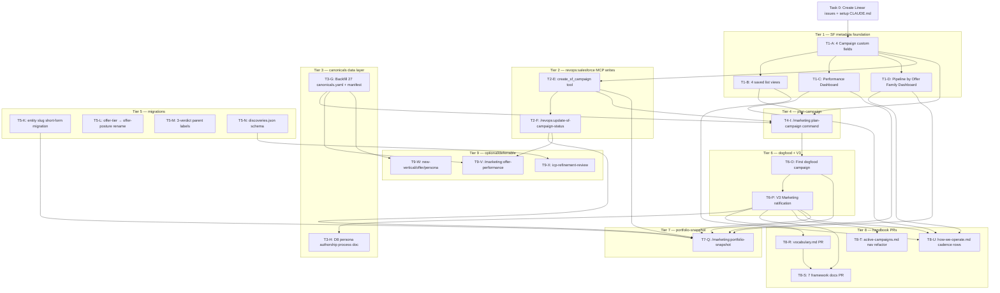

# GTM Campaign Orchestration — Refined Plan

> **Start here for orientation**: `docs/gtm-campaign-orchestration-README.md` — master entry point with TL;DR, decision log, glossary, audit narrative, and per-audience onboarding paths. This refined plan is the per-task execution surface; the README is the navigation surface.

**Linear Project**: [Brite Plugin Marketplace](https://linear.app/brite-nites/project/brite-plugin-marketplace-402b57908532) (team Brite Company, prefix `BC-`)

## BC-ID ↔ Task-ID Mapping

| Task ID | Linear Issue | Task ID | Linear Issue |
|---|---|---|---|
| Task 0 | [BC-8712](https://linear.app/brite-nites/issue/BC-8712) | T5-N | [BC-8722](https://linear.app/brite-nites/issue/BC-8722) |
| T1-A | [BC-8713](https://linear.app/brite-nites/issue/BC-8713) | T2-F | [BC-8723](https://linear.app/brite-nites/issue/BC-8723) |
| T1-B | [BC-8714](https://linear.app/brite-nites/issue/BC-8714) | T4-I | [BC-8724](https://linear.app/brite-nites/issue/BC-8724) |
| T1-C | [BC-8715](https://linear.app/brite-nites/issue/BC-8715) | T9-W | [BC-8725](https://linear.app/brite-nites/issue/BC-8725) |
| T1-D | [BC-8716](https://linear.app/brite-nites/issue/BC-8716) | T9-X | [BC-8726](https://linear.app/brite-nites/issue/BC-8726) |
| T2-E | [BC-8717](https://linear.app/brite-nites/issue/BC-8717) | T6-O | [BC-8727](https://linear.app/brite-nites/issue/BC-8727) |
| T3-G | [BC-8718](https://linear.app/brite-nites/issue/BC-8718) | T9-V | [BC-8728](https://linear.app/brite-nites/issue/BC-8728) |
| T5-K | [BC-8719](https://linear.app/brite-nites/issue/BC-8719) | T6-P | [BC-8729](https://linear.app/brite-nites/issue/BC-8729) |
| T5-L | [BC-8720](https://linear.app/brite-nites/issue/BC-8720) | T3-H | [BC-8730](https://linear.app/brite-nites/issue/BC-8730) |
| T5-M | [BC-8721](https://linear.app/brite-nites/issue/BC-8721) | T7-Q | [BC-8731](https://linear.app/brite-nites/issue/BC-8731) |
|        |        | T8-R | [BC-8732](https://linear.app/brite-nites/issue/BC-8732) |
|        |        | T8-S | [BC-8733](https://linear.app/brite-nites/issue/BC-8733) |
|        |        | T8-T | [BC-8734](https://linear.app/brite-nites/issue/BC-8734) |
|        |        | T8-U | [BC-8735](https://linear.app/brite-nites/issue/BC-8735) |

All 25 issues filed in `Brite Plugin Marketplace` project (initial 22 on 2026-05-12; T2-FA audit-fix BC-8752 added 2026-05-13; milestone-assignment pass on 2026-05-14 normalized to 25). Dependencies wired via `blockedBy` per the Mermaid graph below.

## Summary

Build the plugin-side execution layer for Brite's GTM campaign system: 4 SF Campaign custom fields + 4 saved views + 2 dashboards + 2 new SF MCP write tools + a 27-vertical canonicals data layer + `/marketing:plan-campaign` orchestrator + `/marketing:portfolio-snapshot` reporter, gated by a Marketing-team V3 ratification meeting against a dogfood campaign, with 4 handbook PRs finalizing the canon. 21 BCs across 9 tiers; critical path ~5-6 weeks at single-developer pace.

**Source design doc**: `docs/designs/gtm-campaign-orchestration-design.md` (897 lines, all locks narrated)
**Source v1 plan**: `docs/plans/gtm-campaign-orchestration-plan.md`
**Companion memories**: `memory/project_gtm_campaign_architecture.md`, `memory/project_marketing_vocabulary.md`
**Linear project for these BCs**: Brite Plugin Marketplace (team Brite Company, prefix `BC-`)
**Linear project for downstream campaigns**: Brite GTM
**Cross-repo touch**: `brite-salesforce` (SF metadata deploys), `brite-nites/handbook` (4 PRs for O14/O8)

---

## Architectural anchor (read before any task)

1. **3-layer split (D2)** — Handbook = HOW (process, frameworks, templates, playbooks); Linear = orchestration/state (milestones + 7+2 sub-issues); Plugin = WHAT (entities + state — canonicals, MSPA matrix, learnings, manifest.json, discoveries.json, performance.md).
2. **Campaign unit (D1)** — `Vertical × Persona × Offer × Month`. Calendar year = FY. Slug rule: `{vertical}-{persona}-{offer}-fy{YY}-m{MM}`. Manifest at `docs/campaigns/{entity}/{slug}/manifest.json` is the canonical machine-readable cross-reference; Linear comments are the human-readable mirror.
3. **Entity canon** — Three Brite entities only: `nites`, `supply`, `labs`. Plus `cross-entity` for portfolio-level campaigns. Brite Base is a SaaS product inside Supply, NOT a peer entity.
4. **Status labels (O1)** — Primary: `planning` / `active` / `completed` / `killed`. Overlay: `paused` (substatus on `active`).
5. **Same-month + new copy (O5)** — `-v2` slug suffix (e.g., `municipalities-pubworks-pilot-fy26-m05-v2`).
6. **27-vertical taxonomy** — Authoritative source: `brite-nites/handbook@main:marketing/go-to-market/verticals/README.md`. 6 Active + 8 Exploring + 9 Future = 23 currently; D11 backfills all 27 (the difference is recently-graduated candidates).
7. **discoveries.json signal promotion** — Skills emit category-tagged signals (`title-discovery` / `icp-refinement` / `offer-retirement` / `persona-discovery`); humans promote to handbook via PR.
8. **σ3 SF auto-create** — `plan-campaign` Step 7b calls new revops:salesforce MCP `create_sf_campaign` write tool; on failure, manifest.json gets `salesforce.campaign_id: null` and the operator manually creates (soft-fail; plan-campaign does NOT halt).

Every task below assumes this anchor is loaded.

---

## Task Dependency Graph



Critical path: **T0 → T1-A → T2-E → T4-I → T6-O → T6-P → T7-Q** (7 nodes including Task 0).

---

## Tasks

### Task 0: Generate Linear Issues and Update CLAUDE.md — [BC-8712](https://linear.app/brite-nites/issue/BC-8712)

- **Context**: This plan files 21 new BCs into Linear "Brite Plugin Marketplace" project (team Brite Company, prefix `BC-`). After issues are filed, CLAUDE.md needs review so future agents have current project context. This task runs before any code task.
- **Steps**:
  1. Run `/workflows:create-issues docs/project-plan-refined.md` — files all 21 BCs with cross-linked dependencies. Each BC inherits its task's title, context, ACs, and dependency list.
  2. Capture the BC numbers in a comment at the top of this plan (BC-ID ↔ task-ID mapping) so subsequent ship cycles can reference issue IDs.
  3. Run `/workflows:setup-claude-md` — audits and refactors CLAUDE.md against best practices (size guardrail, anti-slop, @import structure, hook-candidate identification).
  4. Manually update `memory/MEMORY.md` index to add a one-line entry pointing at `memory/project_gtm_campaign_architecture.md` if not already present (it is — verify).
- **Validation**:
  - `mcp__plugin_workflows_linear-server__list_issues team:"Brite Company" project:"Brite Plugin Marketplace" query:"<unique-token-from-each-spec>"` returns 21 issues.
  - Each issue has parentId set per its dependency chain (or `blockedBy` relations) and labels matching its tier (`tier-1` / `tier-2` / etc.).
  - `./scripts/check-guardrails.sh --claude-md CLAUDE.md` exits 0.
  - The BC-ID ↔ task-ID mapping is committed at the top of this file.
- **Complexity**: S
- **Dependencies**: None

---

### Task T1-A: Deploy 4 Campaign custom fields to brite-salesforce — [BC-8713](https://linear.app/brite-nites/issue/BC-8713)

- **Context**: Foundation of σ3 + portfolio rollup. 4 new SF Campaign fields are needed before any saved view, dashboard, or MCP write tool can land. All 4 are managed-package-safe additions to the standard Campaign object. Per O6.Q2 lock in the v1 plan. **Cross-repo**: lives in `brite-salesforce`, deployed via `mcp__plugin_revops_salesforce__deploy_metadata` once T2-E ships, or `sf project deploy start` via the SF CLI directly. **Verify before**: read `gotcha_sf_mcp_username_not_alias.md` in MEMORY — the deploy-metadata tool needs literal username, not alias. **Refinement note from v1**: T1-D may also need an `OfferPosture__c` field; defer that decision into T1-D's implementation, NOT this task.
- **Steps**:
  1. Read existing Campaign object schema in `brite-salesforce` repo to confirm none of the 4 field names collide with existing fields (`Persona__c`, `Offer__c`, `Entity__c`, `Substatus__c`).
  2. Create custom field metadata XML files under `brite-salesforce/force-app/main/default/objects/Campaign/fields/`:
     - `Persona__c.field-meta.xml` — type `Text`, length 64, externalId false, required false
     - `Offer__c.field-meta.xml` — type `Text`, length 64, externalId false, required false
     - `Entity__c.field-meta.xml` — type `Picklist`, values `nites`, `supply`, `labs`, `cross-entity`, default null, restricted true
     - `Substatus__c.field-meta.xml` — type `Picklist`, values `Paused`, default null, restricted true (null is the default state; only `Paused` is explicit)
  3. Add all 4 to the Campaign page layout (`Campaign-Campaign Layout.layout-meta.xml`) in a new "Campaign Orchestration" section.
  4. Run `sf project deploy start --source-dir force-app/main/default/objects/Campaign` against sandbox; verify success.
  5. Run `sf data query --query "SELECT QualifiedApiName FROM EntityDefinition WHERE QualifiedApiName='Campaign'"` then check `FieldDefinition` to confirm all 4 fields exist.
  6. Open PR to `brite-salesforce` main; after merge, deploy to production via the prod-deploy runbook (`/revops:deploy-prod`).
- **Validation**:
  - `sf data query --query "SELECT QualifiedApiName FROM FieldDefinition WHERE EntityDefinition.QualifiedApiName='Campaign' AND QualifiedApiName IN ('Persona__c','Offer__c','Entity__c','Substatus__c')"` returns 4 rows.
  - All 4 fields visible on Campaign Detail layout in the SF UI.
  - All 4 fields appear in list view "Add Field" picker (reportable + filterable).
  - Field-Level Security grants Read+Edit to Marketing + GTM profiles, Read to Sales.
  - Apex test suite passes (`/revops:deploy-sandbox` or `mcp__plugin_revops_salesforce__run_apex_test`).
- **Complexity**: S
- **Dependencies**: Task 0
- **Repo**: brite-salesforce

---

### Task T1-B: Deploy 4 saved Campaign list views — [BC-8714](https://linear.app/brite-nites/issue/BC-8714)

- **Context**: 4 saved list views give GTM team the daily/weekly/monthly portfolio rollup per O6.Q2 + Q3. Default view ("Active Campaigns") is what GTM sync stands up against; other 3 cover quarterly coverage / launch calendar / load balancing. Requires T1-A's fields populated first (filtering on them is the point). List views are stored in `brite-salesforce/force-app/main/default/objects/Campaign/listViews/`.
- **Steps**:
  1. Read existing Campaign list views in the repo to confirm no name collisions.
  2. Create 4 list view metadata XML files:
     - `Active_Campaigns.listView-meta.xml` — `<sharedTo><allCustomerPortalUsers/></sharedTo>` (or per-team), grouping by `Status`, sort by `StartDate` ASC, columns: `Name`, `Vertical__c`, `OwnerId`, `StartDate`, `AmountAllOpportunities`, `NumberOfLeads`, `Description` (with Linear URL convention); filter `Status` IN (`Planned`, `In Progress`) AND `Substatus__c` IN (null, `Paused`).
     - `Coverage_by_Vertical.listView-meta.xml` — grouping `Vertical__c`, filter `Status` ≠ `Aborted` (keeps Completed for retrospective coverage).
     - `Launch_Calendar.listView-meta.xml` — grouping `StartDate` (month), filter `Status` IN (`Planned`, `In Progress`) AND `StartDate >= LAST_N_DAYS:30`.
     - `Owner_Load.listView-meta.xml` — grouping `OwnerId`, same filter as Active Campaigns default.
  3. Deploy via `sf project deploy start --source-dir force-app/main/default/objects/Campaign/listViews/`.
  4. In the SF UI, set "Active Campaigns" as the default list view for the Campaign tab.
  5. Verify GTM team Sharing settings allow read on all 4 views.
- **Validation**:
  - All 4 list views appear in the Campaign tab list-view dropdown.
  - Active Campaigns is the default landing view when navigating to /lightning/o/Campaign/list.
  - Each view's filter applies correctly when a test Campaign record is created with each Status/Substatus combination.
  - Sharing test: a non-admin GTM user can open all 4 views.
- **Complexity**: S
- **Dependencies**: T1-A
- **Repo**: brite-salesforce

---

### Task T1-C: Deploy Performance Dashboard (vertical × month) — [BC-8715](https://linear.app/brite-nites/issue/BC-8715)

- **Context**: One canonical dashboard for the monthly GTM review cadence (O6.Q3 row 3). Combines 4 charts so a single dashboard answers "how did we do this month per vertical?". Referenced by `/marketing:portfolio-snapshot --monthly` (T7-Q) which reads SF via SOQL but operators also visit this dashboard directly. Dashboard metadata lives in `brite-salesforce/force-app/main/default/dashboards/`.
- **Steps**:
  1. Create 4 underlying reports in `brite-salesforce/force-app/main/default/reports/`:
     - `Pipeline_by_Vertical.report-meta.xml` — Source: Opportunities with Campaigns; rows: `Vertical__c`; columns: `LAST_6_MONTHS` (Month); metric: SUM `Amount` (filtered to `IsClosed=false`).
     - `Leads_by_Month.report-meta.xml` — Source: Campaigns with Leads; rows: `StartDate` (Month, current FY); metric: COUNT `Lead.Id`.
     - `Conversion_Funnel.report-meta.xml` — Source: Opportunities with Campaigns; metric chain: Leads → Replies → Meetings → Closed-Won (current month); display as funnel chart.
     - `Verdict_Distribution.report-meta.xml` — Source: Campaigns; rows: `Status` (current month); metric: COUNT `Id`.
  2. Create dashboard XML `GTM_Performance.dashboard-meta.xml` with 4 components, each backed by one of the reports above:
     - Component 1: bar chart on Pipeline_by_Vertical
     - Component 2: line chart on Leads_by_Month
     - Component 3: funnel chart on Conversion_Funnel
     - Component 4: donut chart on Verdict_Distribution
  3. Set running user to a system user (not the deploy user) so dashboard data reflects org-wide reads.
  4. Deploy: `sf project deploy start --source-dir force-app/main/default/dashboards/ --source-dir force-app/main/default/reports/`.
  5. Grant access to GTM + leadership profiles via Folder sharing.
  6. Enable auto-refresh on view (dashboard setting).
- **Validation**:
  - Dashboard renders in `/lightning/r/Dashboard/<id>/view` with all 4 components populated (or showing "No data" gracefully on first load).
  - Refresh dashboard manually — all 4 components requery successfully.
  - Non-admin GTM user can open the dashboard.
  - Auto-refresh-on-view is enabled (verify via Dashboard Properties).
- **Complexity**: M
- **Dependencies**: T1-A (Vertical__c populated)
- **Repo**: brite-salesforce

---

### Task T1-D: Deploy Pipeline by Offer Family Dashboard (offer × quarter) — [BC-8716](https://linear.app/brite-nites/issue/BC-8716)

- **Context**: Different granularity from T1-C — answers "which offers compound vs decay across multiple campaigns?" for quarterly planning (O6.Q3 row 4). **Refinement decision required during this task**: Offer Posture (the 4-value picklist `knowledge` / `free-asset` / `pilot` / `risk-reversal`) is NOT yet a SF field. Decide here whether to add `OfferPosture__c` as a 5th Campaign custom field (extends T1-A scope) or capture posture inside Offer__c text and derive at report time. Recommend the former for filterability; document the decision in the task's PR description.
- **Steps**:
  1. **Decide**: read v1 plan T1-D refinement note + this context paragraph. Choose option A (add `OfferPosture__c` picklist) or option B (derive from Offer__c text). Document in PR. **If option A**: file metadata for the new picklist in same PR as this task, deploy first, then proceed.
  2. Create 3 underlying reports under `brite-salesforce/force-app/main/default/reports/`:
     - `Pipeline_per_Offer_Family.report-meta.xml` — rows: `Offer__c`; metric: SUM `Amount` from Opportunities (current FY).
     - `Revenue_per_Offer_Posture.report-meta.xml` — rows: `OfferPosture__c` (if option A) OR derived from Offer__c (if option B); metric: SUM `Amount` from Won Opportunities (current FY).
     - `Verdict_Distribution_per_Offer.report-meta.xml` — matrix; rows: `Offer__c`; columns: `StartDate` (Quarter, trailing 4); metric: COUNT `Id` grouped by Status.
  3. Create dashboard XML `GTM_Pipeline_by_Offer_Family.dashboard-meta.xml` with 3 components.
  4. Set running user, deploy, grant folder access (same pattern as T1-C).
- **Validation**:
  - Dashboard renders with all 3 components.
  - Each component refreshes on view without error.
  - The Offer Posture decision is documented in the PR description with rationale.
  - If option A: `OfferPosture__c` exists on Campaign (verify via FieldDefinition SOQL) and is on the Detail layout.
  - GTM + leadership profiles have folder access.
- **Complexity**: M
- **Dependencies**: T1-A
- **Repo**: brite-salesforce

---

### Task T2-E: Add `/revops:create-sf-campaign` slash command — [BC-8717](https://linear.app/brite-nites/issue/BC-8717)

- **Context**: First per-record SF write path in the revops plugin. Called by `/marketing:plan-campaign` Step 7b (T4-I) at scaffold time. **Respec'd 2026-05-19 — was originally an MCP write tool.** The `mcp__plugin_revops_salesforce__*` namespace is served by upstream `@salesforce/mcp@0.30.5` (Salesforce-published npm package), so Brite cannot add tools to it. Path 3 (slash command at `plugins/revops/commands/create-sf-campaign.md`) was chosen over Path 1 (stand up a new Brite-owned MCP server) — only two SF write surfaces in GTM v1.0 (T2-E + T2-F), below the threshold where a fresh MCP earns its boilerplate. Skills-compose-skills via the Skill tool is natural composition with `/marketing:plan-campaign`. **Soft-fail behavior is load-bearing**: plan-campaign MUST proceed even if SF create fails, leaving `manifest.json.salesforce.campaign_id` null for manual reconciliation — so every error path exits 0 with structured JSON. **Idempotency rule**: rejecting on duplicate Name=slug is critical so plan-campaign re-runs are safe.
- **Steps**:
  1. Author `plugins/revops/commands/create-sf-campaign.md` with frontmatter declaring `description` + `allowed-tools: Bash, mcp__plugin_revops_salesforce__run_soql_query` (upstream MCP — read-only SOQL surface, used for duplicate-slug + owner-lookup prechecks).
  2. Input flags (all parsed from invocation, missing-flag emits `{ error: "missing_required_flag", flag: "<name>" }` exit 0):
     ```
     --slug --entity --vertical --persona --offer --year --month
     --owner-email --launch-date [--target-org=brite-prod] [--dry-run]
     ```
     `slug` regex `^[a-z0-9-]+-fy\d{2}-m\d{2}(-v\d+)?$`.
  3. Implementation phases:
     - Phase 1 — Slug regex validation. Mismatch → `{ error: "invalid_slug_format", slug: "<v>" }` exit 0.
     - Phase 2 — Idempotency precheck via `mcp__plugin_revops_salesforce__run_soql_query`: `SELECT Id FROM Campaign WHERE Name = '<slug>' LIMIT 1`. Row exists → `{ error: "duplicate_slug", existing_id: "<Id>" }` exit 0.
     - Phase 3 — Owner lookup: `SELECT Id FROM User WHERE Email = '<owner-email>' AND IsActive = TRUE LIMIT 1`. Empty → `{ error: "missing_owner", email: "<email>" }` exit 0.
     - Phase 4 — Dry-run: if `--dry-run`, emit preview JSON + exit. No insert attempted.
     - Phase 5 — Insert via `Bash` shell-out: `sf data create record --sobject Campaign --values "Name='<slug>' Vertical__c='<vertical>' Persona__c='<persona>' Offer__c='<offer>' Entity__c='<entity>' StartDate=<launch-date> OwnerId='<owner-id>' Status='Planned'" --target-org <target-org> --json`. Errors → `{ error: "sf_cli_error", detail: <upstream JSON> }` exit 0 (NOT exit 1).
     - Phase 6 — Construct URL: `sf org display --target-org <target-org> --json | jq -r .result.instanceUrl` → `<instanceUrl>/lightning/r/Campaign/<id>/view`.
     - Phase 7 — Success: single-line `{ "campaign_id": "<id>", "campaign_url": "<url>", "campaign_name": "<slug>" }` on stdout.
  4. Add contract tests at `plugins/revops/tests/test_create_sf_campaign_contracts.py` covering: command file presence, frontmatter shape, all input flags documented, all 5 error keys present, idempotency + owner-lookup SOQL verbatim, soft-fail contract greppable, slug regex verbatim, version bumps.
  5. Update docs: this section (T2-E), `docs/gtm-campaign-orchestration-README.md` §3.6/§3.7/§5/§7/§7.5 (replace MCP-tool framing with slash-command framing), and `docs/decisions/015-gtm-sigma3-sf-campaign-sync.md` (Decision section). Plugin README is upstream Jaganpro content — no Brite-specific commands listing to extend.
  6. Bump revops plugin.json version + marketplace.json entry (per CLAUDE.md gotcha).
- **Validation**:
  - `/revops:create-sf-campaign --dry-run --slug=... ...` returns preview JSON on stdout, no SF mutation.
  - Real-mode invocation against a throwaway slug + `brite-prod` produces a Campaign record with all custom fields mapped (Vertical/Persona/Offer/Entity/StartDate/OwnerId/Status=Planned). Stdout JSON matches `{ campaign_id, campaign_url, campaign_name }`.
  - Re-invocation with the same `--slug` returns `{ error: "duplicate_slug", existing_id }` exit 0.
  - Invocation with bogus `--owner-email` returns `{ error: "missing_owner", email }` exit 0.
  - `pytest plugins/revops/tests/test_create_sf_campaign_contracts.py` passes.
  - Plugin version bumped in both `plugins/revops/.claude-plugin/plugin.json` and the matching `.claude-plugin/marketplace.json` entry.
- **Complexity**: M
- **Dependencies**: T1-A
- **Repo**: britenites-claude-plugins (plugin work only — no `brite-salesforce` edits, no upstream `@salesforce/mcp` edits)

---

### Task T2-F: Add `/revops:update-sf-campaign-status` slash command — [BC-8723](https://linear.app/brite-nites/issue/BC-8723)

- **Context**: Second per-record SF write path in the revops plugin. Called by σ3 trigger automation (T2-FA, BC-8752) on Linear status transitions, and by `/marketing:sync-campaign-status` for manual paused/killed triggers. **Respec'd 2026-05-19 — was originally an MCP write tool.** Same root cause as T2-E: `mcp__plugin_revops_salesforce__*` is served by upstream `@salesforce/mcp@0.30.5` (Salesforce-published npm package), so Brite cannot add tools to it. Path 3 (slash command at `plugins/revops/commands/update-sf-campaign-status.md`) mirrors T2-E's respec'd structure. **Soft-fail behavior is load-bearing** — σ3 webhook can fire repeatedly and must never halt: every error path exits 0 with structured JSON. **Linear → SF status mapping table is locked** (per O6.Q1). **Idempotency rule** added in brainstorm (not in original spec): no-op when current SF state already matches target, saves API calls + prevents `LastModifiedDate` churn on σ3 webhook re-fires.
- **Steps**:
  1. Author `plugins/revops/commands/update-sf-campaign-status.md` with frontmatter declaring `description` + `allowed-tools: Bash, mcp__plugin_revops_salesforce__run_soql_query` (upstream MCP — read-only SOQL for Phase 2 lookup + current-state read).
  2. Input flags (all parsed from invocation, missing-flag emits `{ error: "missing_required_flag", flag: "<name>" }` exit 0):
     ```
     --slug --linear-status [--linear-substatus] [--target-org=brite-prod] [--dry-run]
     ```
     `--linear-status` ∈ `{planning, active, completed, killed}`; `--linear-substatus` ∈ `{empty, paused}`.
  3. Mapping table (locked per O6.Q1):
     | `linear-status` | `linear-substatus` | SF `Status` | SF `Substatus__c` |
     |---|---|---|---|
     | `planning` | (any) | `Planned` | (null) |
     | `active` | (null/empty) | `In Progress` | (null) |
     | `active` | `paused` | `In Progress` | `Paused` |
     | `completed` | (any) | `Completed` | (null) |
     | `killed` | (any) | `Aborted` | (null) |
  4. Implementation phases:
     - Phase 1 — Validate input. Slug regex `^[a-z0-9-]+-fy\d{2}-m\d{2}(-v\d+)?$` (mirrors BC-8717; doubles as SOQL-injection guard). Mismatch → `{ error: "invalid_slug_format", slug: "<v>" }` exit 0. Bad status → `{ error: "invalid_status", value: "<v>" }` exit 0.
     - Phase 2 — Lookup + current-state read via `mcp__plugin_revops_salesforce__run_soql_query`: `SELECT Id, Status, Substatus__c, LastModifiedDate FROM Campaign WHERE Name = '<slug>' LIMIT 1`. 0 rows → `{ warning: "campaign_not_found", slug }` exit 0 (soft-fail; `warning` not `error` because the state is not caller-correctable from this code path). `LastModifiedDate` fetched here so the noop path can echo `updated_at` without an extra round-trip.
     - Phase 3 — Compute mapped target state from the table.
     - Phase 4 — Idempotency no-op pre-check. If `current.Status == mapped.Status` AND `current.Substatus__c == mapped.Substatus__c`, return success with `noop: true` without issuing UPDATE.
     - Phase 5 — Dry-run preview if `--dry-run`. Emit mapping + UPDATE preview JSON, no write.
     - Phase 6 — UPDATE via `Bash` shell-out: `sf data update record --sobject Campaign --record-id <id> --values "Status='<mapped>' Substatus__c='<mapped-or-empty>'" --target-org <org> --json`. Empty-string clears Substatus__c (verify in dry-run; fallback to Composite REST `{Substatus__c: null}` if empty-string doesn't clear). Errors → `{ error: "sf_cli_error", detail: <upstream JSON> }` exit 0. Post-UPDATE: re-SELECT `LastModifiedDate` via the same MCP run_soql_query for the success payload's `updated_at` field.
     - Phase 7 — Construct URL via `sf org display` (`warning: "instance_url_unknown"` fallback).
     - Phase 8 — Success: single-line JSON `{ campaign_id, campaign_url, campaign_name, status, substatus, updated_at }` (union of T2-E's surface + T2-F spec's confirmation fields).
  5. Add contract tests at `plugins/revops/tests/test_update_sf_campaign_status_contracts.py` covering: command file presence, frontmatter shape, all 5 input flags documented, all 5 mapping rows present verbatim, all 5 soft-fail keys (`missing_required_flag`, `invalid_slug_format`, `invalid_status`, `campaign_not_found`, `sf_cli_error`), Phase 2 SOQL verbatim, slug regex verbatim, soft-fail term greppable, idempotency `noop` documented, Substatus__c clearing convention documented, version bumps.
  6. Doc sweep: this section (T2-F), `docs/gtm-campaign-orchestration-README.md` (replace remaining `update_sf_campaign_status MCP tool` references with slash-command framing at lines ~626, ~748, ~791, ~945, ~1098; verify ~960/~1130/~1210/~1257/~1330 already correct), `docs/decisions/015-gtm-sigma3-sf-campaign-sync.md` (already amended 2026-05-19 — cross-check only).
  7. Bump revops plugin.json version + marketplace.json entry (0.2.7 → 0.2.8) per CLAUDE.md gotcha.
- **Validation**:
  - `/revops:update-sf-campaign-status --dry-run --slug=... --linear-status=...` returns mapping preview JSON, no SF mutation.
  - Real invocation against an existing campaign produces SF UPDATE with mapped Status + Substatus__c. Stdout JSON matches `{ campaign_id, campaign_url, campaign_name, status, substatus, updated_at }`.
  - No-op pre-check: re-invocation with same target status returns `{ ..., noop: true }` exit 0 without UPDATE.
  - Campaign-not-found: bogus `--slug` returns `{ warning: "campaign_not_found" }` exit 0.
  - Invalid status: `--linear-status=frozen` returns `{ error: "invalid_status" }` exit 0.
  - All 5 mapping table rows verified against a throwaway slug.
  - `pytest plugins/revops/tests/test_update_sf_campaign_status_contracts.py` passes.
  - Plugin version bumped in both `plugins/revops/.claude-plugin/plugin.json` and the matching `.claude-plugin/marketplace.json` entry.
- **Complexity**: S
- **Dependencies**: T2-E (BC-8717 ✅ shipped 2026-05-19)
- **Repo**: britenites-claude-plugins (plugin work only — no `brite-salesforce` edits, no upstream `@salesforce/mcp` edits)

---

### Task T3-G: Backfill 27 canonicals.yaml + _manifest.yaml — [BC-8718](https://linear.app/brite-nites/issue/BC-8718)

- **Context**: Plugin-side canonicals data layer (per Phase 2 reframe: plugin = WHAT). Source-of-truth for what counts as a valid (vertical, persona, offer) tuple before plan-campaign Step 2 hard-fail check. Per D7 (thin schema) + D11 (all 27 day-1) + Phase 2 reframe (plugin not handbook). **Source of vertical list**: `brite-nites/handbook@main:marketing/go-to-market/verticals/README.md`. **Per-entry depth varies**: 7 Active verticals get full ≥1-persona + ≥1-offer populated; Exploring + Future verticals can be skeleton (slug + display only). Personas graduate via D8 + handbook review (T3-H).
- **Steps**:
  1. Create directory `plugins/marketing/data/canonicals/`.
  2. Fetch the 27-vertical list from handbook (use `mcp__plugin_workflows_context7__query-docs` with `/brite-nites/handbook` if available; fallback: `gh api repos/brite-nites/handbook/contents/marketing/go-to-market/verticals/README.md`).
  3. Author `_manifest.yaml`:
     ```yaml
     schema_version: 1
     verticals:
       - municipalities
       - hoas
       - landscape-lighting
       # ... all 27, alphabetized
     ```
  4. For each of the 27 verticals, author `{vertical}.yaml`:
     ```yaml
     slug: municipalities
     display: "Municipalities"
     aliases: ["munis", "city-government"]  # optional
     playbook_path: "marketing/go-to-market/verticals/municipalities/README.md"  # optional
     personas:
       - slug: public-works-director
         display: "Public Works Director"
         titles: ["Director of Public Works", "Public Works Manager"]
     offers:
       - slug: free-rop-audit
         display: "Free Right-of-Way Audit"
         status: active  # draft | active | retired
         posture: free-asset  # knowledge | free-asset | pilot | risk-reversal
     ```
  5. Populate 7 Active verticals with ≥1 persona + ≥1 offer each (Municipalities, HOAs, Landscape Lighting, Landscape Architects, Builders, Universities, Hospitals — cross-reference handbook prose for accurate persona titles).
  6. Skeleton the remaining 20 verticals (slug + display only; empty personas + offers arrays).
  7. Author `plugins/marketing/data/canonicals/schema.json` JSON Schema for lint validation.
  8. Add a script `plugins/marketing/scripts/lint_canonicals.py` that:
     - Validates every `{vertical}.yaml` against schema.
     - Asserts no duplicate slugs across verticals.
     - Asserts every persona slug is kebab-case.
     - Asserts every offer entry has status ∈ {draft, active, retired}.
     - Asserts every offer has posture ∈ {knowledge, free-asset, pilot, risk-reversal} (per T5-L renaming).
  9. Wire `lint_canonicals.py` into `scripts/validate.sh`.
- **Validation**:
  - `ls plugins/marketing/data/canonicals/*.yaml | wc -l` returns 28 (`_manifest.yaml` + 27 verticals).
  - `_manifest.yaml` lists all 27 vertical slugs alphabetized.
  - 7 Active verticals have ≥1 persona + ≥1 offer.
  - `python plugins/marketing/scripts/lint_canonicals.py` exits 0.
  - `./scripts/validate.sh` includes the lint and exits 0.
  - No persona slug uses snake_case or camelCase.
- **Complexity**: M (mostly data entry + cross-reference)
- **Dependencies**: Task 0
- **Repo**: britenites-claude-plugins

---

### Task T3-H: Document D8 persona authorship process — [BC-8730](https://linear.app/brite-nites/issue/BC-8730)

- **Context**: Per D8 + V3. Marketing decides who authors slugs+titles[] for 27 verticals, cadence + ownership, and how `persona-discovery` signals graduate to canonicals.yaml entries. Soft-gated by V3 (T6-P); skeleton canonicals (T3-G) work without this resolved, but full persona populations need it.
- **Steps**:
  1. Draft `handbook/marketing/standards/canonicals-authorship.md` with sections:
     - Who authors persona slugs+titles[] (proposed: Sarah Cullen as canon owner; Kells consult for offer postures).
     - When personas graduate from "named in handbook ICP prose" to "in canonicals.yaml" — proposed: per-quarter strategic review + ad-hoc tactical promotion when 2+ campaigns request the same persona.
     - Cadence: quarterly review of canonicals.yaml + ad-hoc PR workflow.
     - Promotion criteria for `persona-discovery` discoveries.json signals → canonicals entry: ≥3 sightings across campaigns OR explicit Marketing decision.
     - Per-vertical-revisit policy: every quarter, owner reviews each vertical's personas + offers for retirement candidates.
  2. Cross-link from `handbook/marketing/frameworks/vocabulary.md` (T8-R).
  3. Open PR to `brite-nites/handbook`.
- **Validation**:
  - File exists at `handbook/marketing/standards/canonicals-authorship.md` with all 5 sections populated.
  - Owner named (proposed: Sarah Cullen — confirm at V3).
  - Cadence + criteria explicit.
  - PR open, awaiting handbook-team review.
- **Complexity**: S
- **Dependencies**: T6-P (V3 ratification preferred; can proceed in draft without)
- **Repo**: brite-nites/handbook (PR)

---

### Task T4-I: Implement `/marketing:plan-campaign` command (closes O3) — [BC-8724](https://linear.app/brite-nites/issue/BC-8724)

- **Context**: The orchestrator. 10-step scaffolding that creates one campaign across all 4 layers (Linear milestone + 7+2 sub-issues + plugin dir + manifest.json + SF Campaign via σ3 + EB workspace assignment). Hybrid flag-or-prompt mode (operator can pass `--vertical municipalities --persona public-works-director ...` OR be walked through interactively). **Reference precedent**: BC-2707 two-call confirm pattern from `/marketing:launch-campaign`. **Read first**: `plugins/marketing/commands/launch-campaign.md` for the existing two-call gate idiom + flag-or-prompt convention. **Soft-fail philosophy**: SF auto-create (Step 7b) failure does NOT halt scaffolding; manifest gets null campaign_id; operator manually reconciles.
- **Steps**:
  1. Read `plugins/marketing/commands/launch-campaign.md` thoroughly — it's the most analogous existing command.
  2. Author `plugins/marketing/commands/plan-campaign.md` with frontmatter `description:`, `allowed-tools:` (declare `mcp__plugin_revops_salesforce__create_sf_campaign`, `mcp__plugin_workflows_linear-server__save_issue`, `mcp__plugin_workflows_linear-server__save_milestone`, `mcp__plugin_workflows_linear-server__list_projects`, plus Read/Write/Bash).
  3. Implement Step 1 — Operator invocation:
     - Accept flags: `--vertical` `--persona` `--offer` (required); `--month` `--year` `--entity` (auto-detect for single-entity verticals via canonicals.yaml lookup); optional `--launch-date` `--situation-mining` `--creative-angles` `--dry-run`.
     - If any required flag missing, prompt interactively (one question at a time per `feedback_one_question_at_a_time.md` + `feedback_interview_chunking.md`).
  4. Implement Step 2 — Canonicality validation:
     - Read `plugins/marketing/data/canonicals/_manifest.yaml` + `{vertical}.yaml`.
     - HARD-FAIL with pointer to `/marketing:new-vertical|new-offer|new-persona` (T9-W) if any of (vertical, persona, offer) missing.
  5. Implement Step 3 — Collision check (O5):
     - Compute slug `{vertical}-{persona}-{offer}-fy{YY}-m{MM}`.
     - Check Linear milestones in "Brite GTM" project for existing slug.
     - If collision in same month with different copy → append `-v2` (or `-v3`, etc.).
  6. Implement Step 4 — Dry-run preview:
     - Print full operator-readable plan (slug, entity, vertical, persona, offer, year, month, launch_date, 7+2 sub-issue titles, manifest.json path, SF Campaign payload).
     - If `--dry-run` passed, exit here.
  7. Implement Step 5 — Two-call confirm:
     - First Bash call prints "Confirm? (y/n)" → operator answers in next message.
     - Second Bash call proceeds only if operator confirmed.
  8. Implement Step 6 — Plugin dir + manifest.json:
     - Create `docs/campaigns/{entity}/{slug}/manifest.json` with `schema_version: 1` + slug + entity + vertical + persona + offer + year + month + launch_date + status: planning + salesforce: { campaign_id: null, campaign_url: null } + linear: { milestone_id: null, project_id: null } + emailbison: { workspace, campaign_id: null }.
  9. Implement Step 7a — Linear milestone:
     - Look up "Brite GTM" project ID via `list_projects` (fallback: hardcoded slug if known).
     - Call `save_milestone` with name=slug, description=brief template (D5) including handbook citations + status:planning label + slug + entity + vertical + persona + offer + year + month metadata.
     - Update manifest.json `linear.milestone_id` + `linear.project_id`.
  10. Implement Step 7b — SF Campaign auto-create:
      - Call `mcp__plugin_revops_salesforce__create_sf_campaign(slug, entity, vertical, persona, offer, year, month, owner_email, launch_date)`.
      - On success: update manifest.json `salesforce.campaign_id` + `salesforce.campaign_url`.
      - On failure (`duplicate_slug` / missing owner / SF error): log warning + continue with null values.
  11. Implement Step 8 — Sub-issues (D4 7 standard):
      - For each: Brief, List, Copy, SF, QA, Launch, Active mgmt, Debrief — call `save_issue` with parent=milestone_id, title prefixed by stand-up phase, description with handbook citations, blocked-by chain (List blocks Copy, Copy blocks Launch, Launch blocks Active mgmt, Active mgmt blocks Debrief).
  12. Implement Step 9 — Optional sub-issues:
      - If `--situation-mining` (Labs only — enforce via canonicals entity check) → add Situation Mining sub-issue.
      - If `--creative-angles` → add Creative Angles sub-issue.
  13. Implement Step 10 — Summary output:
      - Print milestone URL, slug, manifest path, sub-issue count, sub-issue IDs.
- **Validation**:
  - Command file exists at `plugins/marketing/commands/plan-campaign.md` with valid frontmatter.
  - Dry-run on Municipalities × Public Works Director × Free ROP Audit × M05 prints a coherent plan and exits without writing anything.
  - Real run on the same args produces: 1 milestone + 7 sub-issues + 1 manifest.json + 1 SF Campaign (verify via `list_milestones` query + `run_soql_query` for SF Campaign by Name=slug).
  - SF auto-create failure injection (e.g., disconnect MCP) does NOT halt — manifest written with null campaign_id, command exits 0 with warning.
  - `--situation-mining` flag on a non-Labs entity errors clearly.
  - `--situation-mining` flag on Labs adds 8th sub-issue.
  - Slug collision in same month auto-suffixes `-v2`.
  - Operator can interrupt at the two-call gate and command exits cleanly.
- **Complexity**: L
- **Dependencies**: T1-A, T1-B, T2-E, T3-G
- **Repo**: britenites-claude-plugins (plugin version bump in same commit per CLAUDE.md)

---

### Task T5-K: Normalize entity slug short-form (O15 migration) — [BC-8719](https://linear.app/brite-nites/issue/BC-8719)

- **Context**: Per Artifact Q1 vocab lock. `campaign-debrief` skill currently writes to `docs/campaigns/brite-{entity}/`; migrate to `docs/campaigns/{entity}/`. One-release-cycle backward-compat window (skill reads both, prefers short-form, logs warning on long-form). Blocks T7-Q because portfolio-snapshot's manifest.json glob needs normalized paths.
- **Steps**:
  1. Grep all SKILL.md for hardcoded `brite-{entity}/` paths:
     ```bash
     grep -rE 'docs/campaigns/brite-(nites|supply|labs)/' plugins/marketing/skills/
     ```
  2. Update `plugins/marketing/skills/campaign-debrief/SKILL.md`:
     - Gate 1 entity validator: accept both `^(brite-nites|brite-supply|brite-labs)$` AND `^(nites|supply|labs)$` for one cycle.
     - Default Write path: short-form `docs/campaigns/{entity}/`.
     - Read path: try short-form first, fall back to long-form, log warning on long-form read.
  3. Update `plugins/marketing/skills/message-market-fit/SKILL.md` §3 ITERATE Step 3.5 cross-skill read path — drop `brite-` prefix.
  4. Update any other skill that references the path (grep result from Step 1).
  5. Write migration script `plugins/marketing/scripts/migrate_entity_slugs.py` that:
     - Walks `docs/campaigns/brite-{entity}/`.
     - Moves contents to `docs/campaigns/{entity}/`.
     - Logs each move; aborts if destination exists (no overwrite).
  6. Run migration script (at design-time directories may not exist; that's fine — script is a no-op).
  7. Add lint check to `scripts/validate.sh` that fails on any new hardcoded `brite-{entity}/` reference.
- **Validation**:
  - `grep -rE 'docs/campaigns/brite-(nites|supply|labs)/' plugins/marketing/skills/` returns nothing (or only inside backward-compat regex literals).
  - campaign-debrief skill written test: invoke with entity=`labs` → writes to `docs/campaigns/labs/`; invoke with entity=`brite-labs` → writes to `docs/campaigns/labs/` AND emits warning.
  - mmf skill written test: reads from `docs/campaigns/labs/`.
  - `./scripts/validate.sh` includes the new lint and passes.
- **Complexity**: S
- **Dependencies**: Task 0
- **Repo**: britenites-claude-plugins

---

### Task T5-L: Rename offer-tier → offer-posture (O12 Identity Q5) — [BC-8720](https://linear.app/brite-nites/issue/BC-8720)

- **Context**: Per ID Q5 vocab lock. Letter codes `T1/T2/T3/T4` collided with list-building's title cascade tiers; concept renamed to Offer Posture; values to descriptive slugs `knowledge` / `free-asset` / `pilot` / `risk-reversal`. Cross-skill consistency required.
- **Steps**:
  1. Update `plugins/marketing/skills/email-copywriting/SKILL.md` §3 — rename `offer_tier` field → `offer_posture`; rename value tokens; add backward-compat reader note (one cycle).
  2. Locate the copy artifact JSON schema (likely `plugins/marketing/skills/email-copywriting/references/copy-artifact-schema.json` or similar). Rename `offer_tier` → `offer_posture`; keep `offer_tier` as deprecated alias in schema for one cycle.
  3. Update `plugins/marketing/commands/launch-campaign.md` — read `offer_posture` (fall back to `offer_tier`).
  4. Update any consumer skills (grep `offer_tier` across plugin):
     ```bash
     grep -rn 'offer_tier' plugins/marketing/
     ```
  5. Update `plugins/marketing/skills/_template/OUTBOUND-SKILL-TEMPLATE.md` if it references the field.
  6. Update T3-G canonicals YAML schema to use `posture` (already specified in T3-G).
  7. Update evals / tests under `plugins/marketing/scripts/` or `tests/` (if present) to use new field name.
- **Validation**:
  - `grep -rn 'offer_tier' plugins/marketing/` returns only backward-compat shim references (with explicit "deprecated alias" comments).
  - email-copywriting skill smoke test produces copy artifact JSON with `offer_posture` key, no `offer_tier` key.
  - launch-campaign command consumes a sample artifact with only `offer_posture` and a sample with legacy `offer_tier`; both work.
  - All 4 new posture values appear in skill prose: `knowledge`, `free-asset`, `pilot`, `risk-reversal`.
- **Complexity**: M
- **Dependencies**: Task 0 (independent of other tiers)
- **Repo**: britenites-claude-plugins

---

### Task T5-M: Rename 3 verdict parent labels (O12 State Q1) — [BC-8721](https://linear.app/brite-nites/issue/BC-8721)

- **Context**: Per State Q1 vocab lock. Verdicts stay distinct (different decision surfaces) but parent labels renamed for clarity: Angle Verdict (creative-angles, pre-experiment) / Experiment Verdict (mmf, post-batch) / Campaign Verdict (debrief, post-campaign). Cross-skill translation table added to each skill's "Cross-skill boundaries" section.
- **Steps**:
  1. Update `plugins/marketing/skills/creative-angles/SKILL.md` — rename "verdict" → "angle verdict" in all section headers + output rows + prose; rename output field if any.
  2. Update `plugins/marketing/skills/message-market-fit/SKILL.md` — rename "verdict" → "experiment verdict" similarly.
  3. Update `plugins/marketing/skills/campaign-debrief/SKILL.md` — rename "verdict" → "campaign verdict" similarly.
  4. Add a "Cross-skill boundaries" section to each of the 3 skills (or append if it exists) with the translation table:
     | Term | Source skill | Decision surface | Timing |
     |---|---|---|---|
     | Angle Verdict | creative-angles | pre-experiment | before mmf |
     | Experiment Verdict | mmf | post-batch | during campaign |
     | Campaign Verdict | campaign-debrief | post-campaign | after campaign closes |
- **Validation**:
  - `grep -n 'verdict' plugins/marketing/skills/creative-angles/SKILL.md` finds only "angle verdict" occurrences (case-insensitive search).
  - Same for mmf → "experiment verdict".
  - Same for debrief → "campaign verdict".
  - Cross-skill translation table present in all 3 SKILL.md files.
  - Anti-slop check: no orphaned bare "verdict" tokens that haven't been re-typed.
- **Complexity**: S
- **Dependencies**: Task 0
- **Repo**: britenites-claude-plugins

---

### Task T5-N: Implement discoveries.json category schema (Phase 2 7.4) — [BC-8722](https://linear.app/brite-nites/issue/BC-8722)

- **Context**: Per Phase 2 architectural pivot. Skills emit category-tagged signals to `docs/campaigns/{entity}/{slug}/discoveries.json`; humans promote to handbook via PR. Four categories: `title-discovery` (list-building) / `icp-refinement` (campaign-debrief) / `offer-retirement` (campaign-debrief) / `persona-discovery` (campaign-debrief).
- **Steps**:
  1. Author `plugins/marketing/data/discoveries-schema.json` JSON Schema:
     ```json
     {
       "$schema": "https://json-schema.org/draft-07/schema",
       "type": "object",
       "properties": {
         "schema_version": { "const": 1 },
         "signals": {
           "type": "array",
           "items": {
             "type": "object",
             "required": ["category", "emitted_at", "emitted_by_skill", "payload"],
             "properties": {
               "category": { "enum": ["title-discovery", "icp-refinement", "offer-retirement", "persona-discovery"] },
               "emitted_at": { "type": "string", "format": "date-time" },
               "emitted_by_skill": { "type": "string" },
               "payload": { "type": "object" },
               "promotion_status": { "enum": ["pending", "promoted", "rejected"], "default": "pending" }
             }
           }
         }
       },
       "required": ["schema_version", "signals"]
     }
     ```
  2. Update `plugins/marketing/skills/list-building/SKILL.md` — add a "Discoveries" section instructing the skill to append `title-discovery` signals to `docs/campaigns/{entity}/{slug}/discoveries.json` on operator confirmation.
  3. Update `plugins/marketing/skills/campaign-debrief/SKILL.md` — same pattern for `icp-refinement`, `offer-retirement`, `persona-discovery` categories.
  4. Add lint script `plugins/marketing/scripts/lint_discoveries.py` validating any discoveries.json against the schema; wire into validate.sh.
  5. Document the promotion workflow (signal → human review → handbook PR) in `plugins/marketing/skills/_shared/discoveries-promotion.md` (or similar). T9-X will operationalize the review step.
- **Validation**:
  - Schema file exists at `plugins/marketing/data/discoveries-schema.json` and validates as JSON Schema draft-07.
  - list-building SKILL.md references discoveries emission with category `title-discovery`.
  - campaign-debrief SKILL.md references 3 categories.
  - `lint_discoveries.py` on a sample file passes; on an invalid file (wrong category) fails clearly.
  - `./scripts/validate.sh` exits 0 with the new lint.
- **Complexity**: M
- **Dependencies**: Task 0
- **Repo**: britenites-claude-plugins

---

### Task T6-O: Run first dogfood campaign through plan-campaign + capture friction — [BC-8727](https://linear.app/brite-nites/issue/BC-8727)

- **Context**: Real-world validation of T4-I. Pick one campaign from brite-gtm portfolio (recommended starter: a Brite Labs venue partnership like Zoos or Aquariums — already has handbook playbook). Instantiate manually as dogfood; iterate template based on friction. Friction log feeds V3 (T6-P) and likely lands as inline edits to plan-campaign before T7-Q ships.
- **Steps**:
  1. Choose campaign: consult brite-gtm `docs/campaign-portfolio.md` for a 🟢-graduated candidate. Recommend: Brite Labs × Zoo GM × Free Lighting Audit × M06 (or similar — confirm at session start).
  2. Run `/marketing:plan-campaign --vertical zoos --persona zoo-gm --offer free-lighting-audit --month 06 --year 26 --entity labs --launch-date 2026-06-15` (replace with actual choice).
  3. Verify all 4 layer artifacts created (Linear milestone + 7 sub-issues + manifest.json + SF Campaign).
  4. Walk through each sub-issue manually, attempting to execute the next stand-up (Brief → List → Copy → ...). Capture every friction point.
  5. Maintain `docs/plans/gtm-campaign-orchestration-friction-log.md` with:
     - Time, friction observed, severity (blocker / annoyance / minor), root cause hypothesis, proposed fix.
  6. Hot-patch obvious blockers in plan-campaign or T3-G canonicals; defer the rest to V3 review.
  7. Run at least 1 EB campaign launch (handoff to `/marketing:launch-campaign` from the Launch sub-issue) to validate end-to-end flow.
  8. Eventually execute a debrief (could be future-state for full validation — at minimum stub the debrief sub-issue).
- **Validation**:
  - 1 milestone in Linear "Brite GTM" project with correct slug + 7 sub-issues.
  - 1 manifest.json populated in `docs/campaigns/labs/{slug}/`.
  - 1 SF Campaign with status Planned then transitions to In Progress on first launch.
  - 1 EB campaign launched (verify via emailbison MCP list_campaigns).
  - Friction log committed with ≥5 entries (anything <5 means the dogfood wasn't pushed hard enough — re-run with adversarial mindset).
  - Hot-patches applied to plan-campaign are documented in PR description.
- **Complexity**: M
- **Dependencies**: T4-I
- **Repo**: britenites-claude-plugins (friction log + hot-patches)

---

### Task T6-P: V3 Marketing ratification meeting — [BC-8729](https://linear.app/brite-nites/issue/BC-8729)

- **Context**: Load-bearing M2/M3 gate per V3. Marketing (Sarah Cullen + Kells) reviews canonicals.yaml + framework docs + portfolio-snapshot dry-run packet (against T6-O dogfood). Output: ratification or rejection of 6 decisions; output determines whether T7-Q + T1-D ship as-designed (M2), downgrade (M3), or ship with modifications. **Run T7-Q in dry-run mode BEFORE this meeting** so V3 sees real markdown packet against real data.
- **Steps**:
  1. Schedule 60-min meeting with Sarah Cullen + Kells (proposed window: post-T6-O dogfood, pre-Tier 8 PRs).
  2. Prepare review packet (commit as `docs/v3-ratification-packet-{date}.md`):
     - Canonicals YAML structure (T3-G output sample).
     - 4-layer offer model + Offer Posture rename rationale.
     - ICP=template / Segment=instance vocabulary.
     - 3 verdict vocabularies kept distinct + translation table.
     - discoveries.json category-tagged pattern.
     - Portfolio-snapshot dry-run markdown packet (run T7-Q in pre-release mode against T6-O dogfood — even before T7-Q is fully production-ready, the dry-run preview is the deliverable).
  3. Conduct meeting; capture ratify/reject/modify decisions per item.
  4. Document outcome in `docs/v3-ratification-outcome-{date}.md`:
     - For each of the 6 items: status + Marketing rationale + any modifications.
     - Decision on M2 (ship T7-Q + T1-D + Tier 8) vs M3 (drop T7-Q + T1-D; keep T1-C + saved views).
  5. If M3 decision: file 2 sibling backlog BCs to defer T7-Q + T1-D; close them as won't-fix or move to long-tail.
- **Validation**:
  - V3 outcome document exists with explicit ratify/reject/modify per all 6 items.
  - M2-vs-M3 decision documented.
  - If modifications: action items filed as follow-up tasks (atomic, agent-executable) before Tier 8 begins.
  - If M3: T7-Q + T1-D status updated in Linear accordingly.
- **Complexity**: S (meeting + sign-off + doc)
- **Dependencies**: T6-O
- **Repo**: britenites-claude-plugins (review packet + outcome doc)

---

### Task T7-Q: Implement `/marketing:portfolio-snapshot --monthly | --quarterly` — [BC-8731](https://linear.app/brite-nites/issue/BC-8731)

- **Context**: Read-only synthesis orchestrator. Merges SF quantitative (via SOQL on T1-A fields) + Linear orchestration (via list_issues on Brite GTM milestones) + plugin filesystem qualitative (learnings.md + mmf-matrix.md + analysis-*.md + manifest.json glob). Emits ONE markdown packet per invocation. **Anti-creep guards are load-bearing**: never mutates source; never re-runs debrief; markdown-only output; no new metric definitions. **V3-gated**: only ships if T6-P ratifies M2 (not M3 downgrade).
- **Steps**:
  1. Read v1 plan T7-Q spec sketch + design doc Section 6.5 (O6.Q5).
  2. Author `plugins/marketing/commands/portfolio-snapshot.md`. Frontmatter declares `allowed-tools`:
     - `mcp__plugin_revops_salesforce__run_soql_query`
     - `mcp__plugin_workflows_linear-server__list_issues`
     - `mcp__plugin_workflows_linear-server__get_issue`
     - `mcp__plugin_workflows_linear-server__list_milestones`
     - Read, Glob, Bash
  3. Implement flag parsing:
     - `--monthly` (default window: previous calendar month) OR `--quarterly` (default window: previous calendar quarter).
     - Reject `--weekly`, `--custom-window`, `--forecast`, `--charts` (anti-creep).
  4. Implement data reads:
     - SF Campaigns via `run_soql_query`: `SELECT Id, Name, Vertical__c, Offer__c, Persona__c, Entity__c, Status, Substatus__c, StartDate, EndDate, AmountAllOpportunities, AmountWonOpportunities, NumberOfLeads FROM Campaign WHERE StartDate >= :window_start AND StartDate <= :window_end`.
     - Linear milestones via `list_milestones` + `list_issues` on Brite GTM project, filtered by start date.
     - Plugin filesystem: glob `docs/campaigns/*/*/manifest.json`; for each in-window manifest, read sibling `learnings.md` (Summary/What-works/What-doesn't sections), `mmf-matrix.md` (Results Log), `analysis-*.md` (verdict tokens).
  5. Implement output sections:
     - `--monthly`:
       1. Portfolio shape (count by Vertical + Entity + Offer Posture)
       2. Pipeline summary (sum AmountAll + sum NumberOfLeads, with vertical/offer breakdowns)
       3. Verdict distribution (count per Campaign Verdict)
       4. Transferable insights (extracted from learnings.md What-works across campaigns)
       5. Action items (extracted from learnings.md + analysis-*.md flagged items)
     - `--quarterly`: all of the above + Cross-quarter MSPA transitions + Cumulative transferables + Per-offer-version aggregation (graceful empty if T9-V hasn't shipped) + Coverage-gap callouts (verticals with 0 campaigns in window).
  6. Implement output writer:
     - `--monthly` → `docs/campaigns/_reviews/monthly-{YYYY-MM}.md`
     - `--quarterly` → `docs/campaigns/_reviews/quarterly-{YYYY-Q}.md`
     - Frontmatter: `schema_version: 1` + `generated_at: <ISO>` + `window: {start, end}` + `command_version: <plugin version>`.
  7. Implement anti-creep guards (assert in code or document explicitly):
     - No writes outside `docs/campaigns/_reviews/`.
     - No re-runs of campaign-debrief logic; only reads its outputs.
     - No new metric formulas; only aggregates pre-computed fields.
  8. Add tests / fixture: stub one campaign's full artifact set and confirm output matches snapshot.
- **Validation**:
  - Command file exists at `plugins/marketing/commands/portfolio-snapshot.md` with valid frontmatter.
  - `--monthly` against the T6-O dogfood data produces a coherent markdown packet with all 5 sections populated (or graceful empty for verdict distribution / transferables if dogfood is too early).
  - `--quarterly` produces all 5 monthly sections + 4 quarterly-only sections.
  - Output frontmatter has `schema_version`, `generated_at`, `window`, `command_version`.
  - Command rejects `--weekly` / `--custom-window` flags with clear error.
  - Command does NOT write outside `docs/campaigns/_reviews/`.
  - Command does NOT mutate source manifest.json or learnings.md.
- **Complexity**: L
- **Dependencies**: T1-C, T1-D, T2-E, T2-F, T5-K, T6-O, T6-P (V3 must not reject)
- **Repo**: britenites-claude-plugins

---

### Task T8-R: Handbook PR — vocabulary.md (O14) — [BC-8732](https://linear.app/brite-nites/issue/BC-8732)

- **Context**: Per O14. Promote `memory/project_marketing_vocabulary.md` to handbook canon at `handbook/marketing/frameworks/vocabulary.md`. 5 vocabulary categories (Identity, State, Process/Framework, Artifact, Metric) — all already locked. V3-ratified at T6-P.
- **Steps**:
  1. Read `memory/project_marketing_vocabulary.md` for the full disambiguation content.
  2. Read `handbook/marketing/` existing structure to confirm `frameworks/` directory exists; create if not.
  3. Author `handbook/marketing/frameworks/vocabulary.md` with sections:
     - Identity (Vertical / Market / ICP / Segment / 4-layer offer model / Offer Posture)
     - State (Angle Verdict / Experiment Verdict / Campaign Verdict + cross-skill translation)
     - Process / Framework (no decisions; canonical sources locked — list them)
     - Artifact (entity slug short-form normalization)
     - Metric (no decisions; canonical sources locked — list them)
  4. Cross-link from existing handbook docs:
     - `marketing/campaign-lifecycle.md` (add "Vocabulary" reference)
     - `marketing/campaign-planning.md`
     - `marketing/go-to-market/verticals/README.md`
  5. Open PR to `brite-nites/handbook`.
- **Validation**:
  - File exists at `handbook/marketing/frameworks/vocabulary.md` with all 5 sections.
  - Cross-links present in 3+ existing handbook docs.
  - PR open, awaiting review.
  - Content matches V3 ratification outcome (no unratified items snuck in).
- **Complexity**: M
- **Dependencies**: T6-P
- **Repo**: brite-nites/handbook (PR)

---

### Task T8-S: Handbook PR — 7 framework docs (O14) — [BC-8733](https://linear.app/brite-nites/issue/BC-8733)

- **Context**: 7 framework docs (vocabulary.md was T8-R) promote framework content currently lodged inside SKILL.md files to handbook canon. Skills become cross-references instead of canonical owners. Reduces drift. Per O14.
- **Steps**:
  1. Per framework, identify the source SKILL.md owner + the framework content within it:
     - `mspa-flywheel.md` — owner: gtm-strategy or message-market-fit (find which carries the MSPA matrix definition).
     - `kellens-laws.md` — owner: likely email-copywriting.
     - `asymmetry-rubric.md` — owner: situation-mining.
     - `offer-postures.md` — owner: email-copywriting (the 4-posture taxonomy).
     - `value-equation.md` — owner: gtm-strategy.
     - `recency-waterfall.md` — owner: list-building.
     - `verdicts-cross-reference.md` — owner: synthesizes from creative-angles + mmf + campaign-debrief.
  2. For each framework:
     - Extract canonical text from source SKILL.md.
     - Author `handbook/marketing/frameworks/{framework}.md`.
     - Update source SKILL.md to replace canonical text with a one-line cross-reference: `See handbook/marketing/frameworks/{framework}.md for canonical definition.`
  3. Cross-link each new framework doc from `handbook/marketing/frameworks/vocabulary.md` (T8-R).
  4. Open handbook PR (separate from T8-R for review clarity).
  5. Open companion britenites-claude-plugins PR with SKILL.md cross-reference updates; merge AFTER handbook PR lands (so links work).
- **Validation**:
  - 7 framework docs exist in handbook.
  - Each source SKILL.md cross-references its framework doc.
  - No duplicate canonical text (plugin defers to handbook).
  - Both PRs open + cross-linked.
- **Complexity**: L
- **Dependencies**: T6-P, T8-R
- **Repo**: brite-nites/handbook (PR) + britenites-claude-plugins (PR)

---

### Task T8-T: Handbook PR — active-campaigns.md nav refactor (O8) — [BC-8734](https://linear.app/brite-nites/issue/BC-8734)

- **Context**: Per D6 + O6.Q1. `handbook/marketing/active-campaigns.md` becomes a navigation pointer (not live state). Points at SF list view URL (primary, from T1-B) + Linear "Brite GTM" project URL (secondary, for per-campaign drill-down).
- **Steps**:
  1. Read existing `handbook/marketing/active-campaigns.md`.
  2. Rewrite as 1-page nav doc:
     - "How to find active campaigns" — primary path: SF list view URL (insert URL from T1-B Active Campaigns saved view).
     - "How to drill into one campaign" — secondary path: Linear "Brite GTM" project URL.
     - "What used to live here" — link to handbook history if useful.
  3. Grep handbook for inbound links to active-campaigns.md and update any that referenced the old prose.
  4. Open PR to `brite-nites/handbook`.
- **Validation**:
  - File rewritten to 1 page (≤100 lines) of navigation prose.
  - Both URLs present and clickable.
  - No stale prose about specific campaigns in the file.
  - Inbound links from other handbook docs still resolve to relevant content.
  - PR open.
- **Complexity**: S
- **Dependencies**: T6-P, T1-B (for SF URL)
- **Repo**: brite-nites/handbook (PR)

---

### Task T8-U: Handbook PR — how-we-operate.md cadence rows (O14) — [BC-8735](https://linear.app/brite-nites/issue/BC-8735)

- **Context**: Per O6.Q3 cadence-to-view mapping. Each cadence row (daily / weekly GTM sync / monthly review / quarterly planning) references specific SF view URL + plugin command per Q3 lock.
- **Steps**:
  1. Read existing `handbook/marketing/how-we-operate.md` cadence section.
  2. Update cadence table per Q3:
     | Cadence | SF View | Plugin Command |
     |---|---|---|
     | Daily | (none — no portfolio rollup) | (none) |
     | Weekly GTM sync | Active Campaigns + Launch Calendar (URLs) | (none) |
     | Monthly review | Coverage by Vertical + Performance Dashboard (URLs) | `/marketing:portfolio-snapshot --monthly` |
     | Quarterly planning | Coverage by Vertical (FY) + Performance Dashboard (FY) + Pipeline by Offer Family Dashboard (URLs) | `/marketing:portfolio-snapshot --quarterly` + brite-gtm campaign-portfolio.md |
  3. Insert actual URLs from T1-B (saved views) + T1-C (Performance Dashboard) + T1-D (Pipeline Dashboard).
  4. Cross-link from `handbook/marketing/frameworks/vocabulary.md` (T8-R).
  5. Open PR to `brite-nites/handbook`.
- **Validation**:
  - Cadence section updated with the 4-row table.
  - All SF URLs present (not placeholder text).
  - Plugin command names + flags spelled correctly per T7-Q.
  - PR open.
- **Complexity**: S
- **Dependencies**: T1-B, T1-C, T1-D, T6-P (V3 ratification)
- **Repo**: brite-nites/handbook (PR)

---

### Task T9-V: Implement `/marketing:offer-performance` command (O13) — [BC-8728](https://linear.app/brite-nites/issue/BC-8728)

- **Context**: Per O13. Per-offer-version performance synthesis. Reads manifest.json glob + EB stats + SF Campaign data; emits `docs/campaigns/{entity}/offers/{slug}/{version}/performance.md` per offer-version. Feeds back into mmf ITERATE Step 3.6. Optional / deferrable; ship after Tier 7.
- **Steps**:
  1. Author `plugins/marketing/commands/offer-performance.md`. Frontmatter `allowed-tools` covers SF SOQL + EB stats + Read/Glob/Write.
  2. Implement flag parsing:
     - `--offer-slug` (required)
     - `--version` (optional; default: all versions)
     - `--entity` (auto-detect from canonicals)
  3. Read offer entries from canonicals (T3-G) to validate `--offer-slug`.
  4. Glob `docs/campaigns/{entity}/*/manifest.json` for manifests referencing this offer slug.
  5. For each manifest: read sibling artifacts + look up EB campaign stats via `mcp__emailbison-b2b__get_campaign_stats` (or personal workspace) + SF Campaign aggregates via `run_soql_query`.
  6. Synthesize per-version performance markdown:
     - Reply rates, meeting rates, pipeline contribution, comparison vs prior version.
  7. Write to `docs/campaigns/{entity}/offers/{slug}/{version}/performance.md` with frontmatter (schema_version, generated_at, command_version).
- **Validation**:
  - Command file exists with valid frontmatter.
  - Smoke test against T6-O dogfood offer produces a coherent performance.md.
  - Output path matches spec.
  - Frontmatter present.
- **Complexity**: M
- **Dependencies**: T2-F, T3-G
- **Repo**: britenites-claude-plugins

---

### Task T9-W: Implement `/marketing:new-vertical` / `new-offer` / `new-persona` sibling commands — [BC-8725](https://linear.app/brite-nites/issue/BC-8725)

- **Context**: When plan-campaign Step 2 hard-fails on missing canonicals entry, these commands bootstrap the addition. Each creates a canonicals.yaml entry + handbook PR draft for review. Per O3 Step 2 / O10.
- **Steps**:
  1. Author `plugins/marketing/commands/new-vertical.md`:
     - Flags: `--slug --display [--aliases comma-list] [--playbook-path]`.
     - Validates slug is kebab-case + not already in `_manifest.yaml`.
     - Appends slug to `_manifest.yaml` (alphabetized).
     - Creates new `{slug}.yaml` with skeleton (slug + display only; empty personas/offers).
     - Emits handbook PR draft (text/diff for operator to apply manually).
     - Prints "Resume plan-campaign with: `/marketing:plan-campaign --vertical {slug} ...`".
  2. Author `plugins/marketing/commands/new-offer.md`:
     - Flags: `--vertical --slug --display --posture {knowledge|free-asset|pilot|risk-reversal} [--status draft|active|retired]`.
     - Validates vertical exists in canonicals.
     - Appends offer entry to `{vertical}.yaml`.
     - Emits handbook PR draft.
  3. Author `plugins/marketing/commands/new-persona.md`:
     - Flags: `--vertical --slug --display [--titles comma-list]`.
     - Validates vertical exists.
     - Appends persona entry to `{vertical}.yaml`.
     - Emits handbook PR draft.
  4. All 3 use the two-call confirm gate before writing.
- **Validation**:
  - 3 command files exist with valid frontmatter.
  - Each successfully bootstraps a test entry against canonicals.yaml.
  - Each emits a handbook PR draft (markdown blob).
  - Each prints resume-plan-campaign instruction on success.
  - Lint script (T3-G `lint_canonicals.py`) passes after each addition.
- **Complexity**: M
- **Dependencies**: T3-G
- **Repo**: britenites-claude-plugins

---

### Task T9-X: Implement `/marketing:icp-refinement-review` command — [BC-8726](https://linear.app/brite-nites/issue/BC-8726)

- **Context**: Reads pending `icp-refinement` signals from discoveries.json across all campaigns; presents to operator for promotion decision; emits handbook PR draft. Per discoveries.json promotion pattern (T5-N). Tier 9 / deferrable.
- **Steps**:
  1. Author `plugins/marketing/commands/icp-refinement-review.md`.
  2. Implement:
     - Glob `docs/campaigns/*/*/discoveries.json`.
     - Filter signals where `category=icp-refinement` AND `promotion_status=pending`.
     - Group signals by Vertical (extracted from manifest sibling).
     - For each group: present signals to operator, ask "promote / reject / defer", capture decision.
     - On "promote": flip signal `promotion_status` to `promoted`; emit handbook PR draft for `handbook/marketing/go-to-market/verticals/{vertical}/README.md` (or equivalent).
     - On "reject": flip to `rejected`.
     - On "defer": leave pending.
  3. Update discoveries.json files in place with new promotion_status values.
- **Validation**:
  - Command file exists.
  - Smoke test against fixture discoveries.json file presents signals + accepts decisions + updates promotion_status.
  - Handbook PR draft generated for promoted signals.
  - discoveries-schema (T5-N) lint still passes after updates.
- **Complexity**: M
- **Dependencies**: T5-N
- **Repo**: britenites-claude-plugins

---

## Coverage check against v1 plan

All 21 BCs from the v1 plan are present in refined form:
- Tier 1: T1-A, T1-B, T1-C, T1-D ✓
- Tier 2: T2-E, T2-F ✓
- Tier 3: T3-G, T3-H ✓
- Tier 4: T4-I ✓
- Tier 5: T5-K, T5-L, T5-M, T5-N ✓
- Tier 6: T6-O, T6-P ✓
- Tier 7: T7-Q ✓
- Tier 8: T8-R, T8-S, T8-T, T8-U ✓
- Tier 9: T9-V, T9-W, T9-X ✓

Plus Task 0 prepended. 22 total tasks. Nothing dropped from v1.

## V3 gate position (reference)

V3 ratification (T6-P) is load-bearing for: M2-vs-M3 fallback on T7-Q + T1-D; Tier 8 handbook PRs (T8-R/S/T/U); persona authorship process (T3-H). V3 runs AGAINST a populated dogfood snapshot (T6-O output), not an empty hypothetical. T7-Q ships in two phases: Phase 1 = dry-run dogfood snapshot for V3 review (during T6-P prep); Phase 2 = production after V3 pass.

## Sequencing recommendation

1. **Sprint 1**: Task 0 + T1-A + T1-B (foundation; serial).
2. **Sprint 2 (parallelizable)**: T1-C + T1-D + T2-E + T3-G + T5-K + T5-L + T5-M + T5-N (most can run in parallel; T2-F follows T2-E).
3. **Sprint 3**: T4-I (depends on T1-A, T1-B, T2-E, T3-G).
4. **Sprint 4**: T6-O dogfood → T7-Q Phase 1 (dry-run) → T6-P V3 meeting.
5. **Sprint 5 (if M2)**: T7-Q Phase 2 production + T8-R + T8-S + T8-T + T8-U + T3-H.
6. **Sprint 6 (optional)**: T9-V + T9-W + T9-X (deferrable; file as backlog if priorities shift).

Critical path is ~6 sprints (5-6 weeks at single-developer pace), compressible to ~4 if Tier 1 + Tier 2 + Tier 3 + Tier 5 parallelize aggressively in Sprints 1-2.
